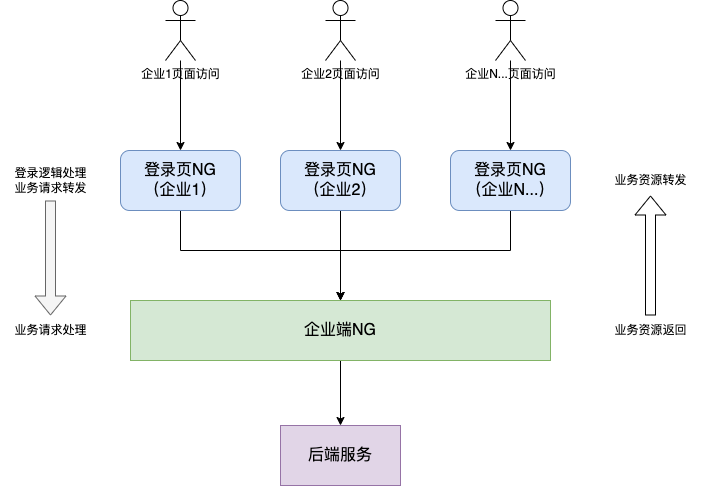

P2-5号工程前端登录页微服务拆分
一、需求描述
为满足合规要求将原有企业端前端部署页面一分为二独立部署。
二、带来的问题
1. 如何保持登录态（登录成功后TOKEN如何传递）
2. 新企业接入前端如何部署（手动部署？自动部署）
3. 不同企业登录后，如何做到退出跳转正确的登录页面？
三、整体方案
    为保持登录态,我们将存有TOKEN数据的cookie存放在根域名路径下，也就是登录页NG下，用户所有请求均通过登录页NG进行分发，登录相关页面及请求直接访问登录NG资源，而其他业务页面及请求通过登录NG代理转发到业务NG；每新增一个企业使用，将为其新增一套个性化UI的登录NG，业务相关界面均通过此NG转发。
3.1 部署架构图

3.2 部署设计

新企业接入前端如何部署的问题，通过改造原因coding持续构建脚本，新企业接入时，部署个性化登录页NG仅需3步。
1、tsf创建部署组
2、流水线配置部署组id
3、选择所需环境及页面参数，立即构建

3.3 退出登录处理
由于所有资源均通过登录页NG分发，所以浏览器URL中域名保持不变，只需将原有企业端退出逻辑跳转路径更改为相对路径下的登录页路由地址即可。

【方案2】
登录页下使用iframe内嵌，企业端页面，通过postMessage传递token数据。

优势：
业务请求不用通过登录页NG转发，页面内部嵌入iframe，通过iframe内部router跳转。