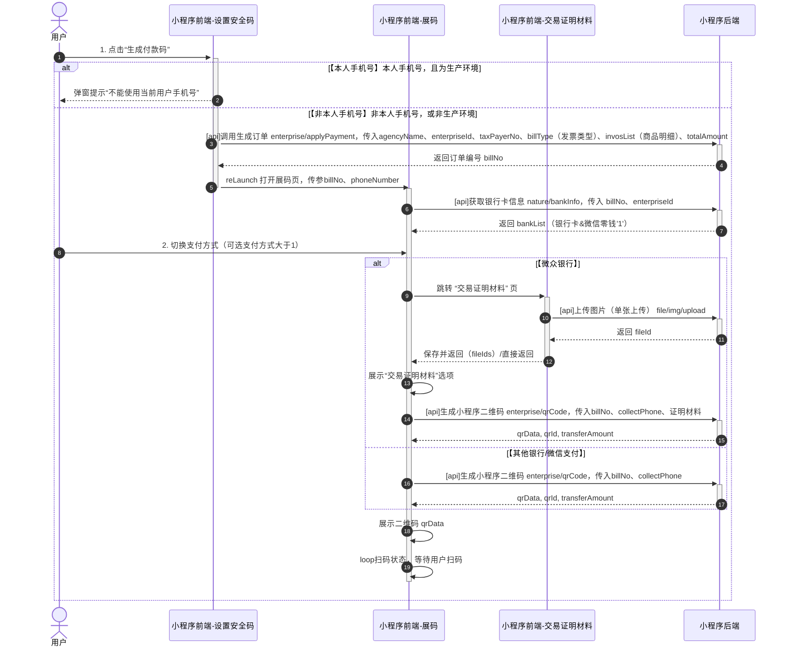

```mermaid
sequenceDiagram
autonumber
    actor 用户
    participant 前端 as 小程序前端-设置安全码
    participant 前端展码 as 小程序前端-展码
    participant 前端证明 as 小程序前端-交易证明材料
    participant 后端 as 小程序后端

    用户->>+前端: 1. 点击“生成付款码”
    activate 前端
    alt 【本人手机号】本人手机号，且为生产环境
        前端-->>用户: 弹窗提示“不能使用当前用户手机号”
    else 【非本人手机号】非本人手机号，或非生产环境
        前端->>+后端: [api]调用生成订单 enterprise/applyPayment，传入agencyName、enterpriseId、taxPayerNo、billType（发票类型）、invosList（商品明细）、totalAmount
        后端-->>-前端: 返回订单编号 billNo
        前端->>前端展码: reLaunch 打开展码页，传参billNo、phoneNumber
        deactivate 前端
        activate 前端展码
        前端展码->>+后端: [api]获取银行卡信息 nature/bankInfo，传入 billNo、enterpriseId
        后端-->>-前端展码: 返回 bankList （银行卡&微信零钱'1'）
        用户->>前端展码: 2. 切换支付方式（可选支付方式大于1）
        alt 【微众银行】
            前端展码->>+前端证明: 跳转 “交易证明材料” 页
            前端证明->>+后端: [api]上传图片（单张上传） file/img/upload
            后端-->>-前端证明: 返回 fileId
            前端证明-->>-前端展码: 保存并返回（fileIds）/直接返回
            前端展码->>前端展码: 展示“交易证明材料”选项
            前端展码->>+后端: [api]生成小程序二维码 enterprise/qrCode，传入billNo、collectPhone、证明材料
            后端-->>-前端展码: qrData, qrId, transferAmount
        else 【其他银行/微信支付】
            前端展码->>+后端: [api]生成小程序二维码 enterprise/qrCode，传入billNo、collectPhone
            后端-->>-前端展码: qrData, qrId, transferAmount
        end

        前端展码->>前端展码: 展示二维码 qrData
        前端展码->>前端展码: loop扫码状态，等待用户扫码
        deactivate 前端展码
    end
```
