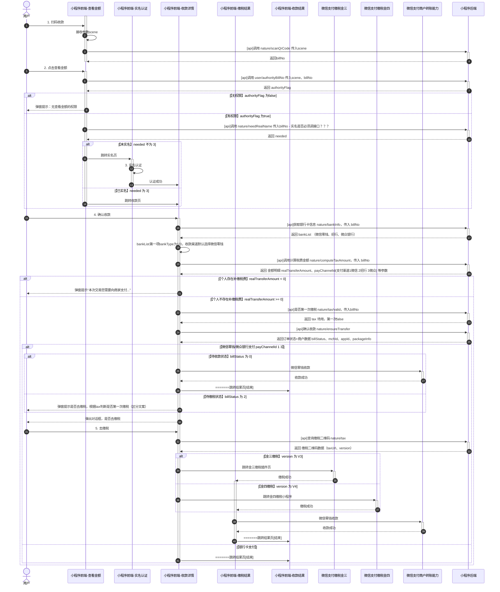

```mermaid
sequenceDiagram
autonumber
    actor 用户
    participant 前端 as 小程序前端-查看金额
    participant 前端实名 as 小程序前端-实名认证
    participant 前端收款 as 小程序前端-收款详情
    participant 前端缴税结果 as 小程序前端-缴税结果
    participant 前端收款结果 as 小程序前端-收款结果
    participant 缴税金三 as 微信支付缴税金三
    participant 缴税金四 as 微信支付缴税金四
    participant 商户转账 as 微信支付商户转账能力
    participant 后端 as 小程序后端

    activate 前端
    用户->>前端: 1. 扫码收款
    前端->>前端: 接收参数scene
    前端->>+后端: [api]调用 nature/scanQrCode 传入scene
    后端-->>-前端: 返回billNo
    deactivate 前端

    用户->>+前端: 2. 点击查看金额
    前端->>+后端: [api]调用 user/authorityBillNo 传入scene、billNo
    后端-->>-前端: 返回 authorityFlag

    alt 【无权限】authorityFlag 为false
        前端-->>用户: 弹窗提示：无查看金额的权限
    else 【有权限】authorityFlag 为true
        前端->>+后端: [api]调用 nature/needRealName 传入billNo - 实名是否必须调接口？？？
        后端-->>-前端: 返回 needed
        alt 【未实名】needed 不为 3
            前端->>+前端实名: 跳转实名页
            前端实名->>前端实名: 3. 实名认证
            前端实名->>-前端收款: 认证成功
        else 【已实名】needed 为 3
            前端->>-前端收款: 跳转收款页
        end
    end
    用户->>+前端收款: 4. 确认收款
    前端收款->>+后端: [api]获取银行卡信息 nature/bankInfo，传入 billNo
    后端-->>-前端收款: 返回 bankList （微信零钱、招行、微众银行）
    前端收款->>前端收款: bankList第一项bankType为1/3，收款渠道默认选择微信零钱
    前端收款->>+后端: [api]调用计算税费金额 nature/computeTaxAmount，传入 billNo
    后端-->>-前端收款: 返回 金额明细 realTransferAmount、payChannelId(支付渠道1微信 2招行 3微众) 等参数

    alt 【个人存在补缴税费】realTransferAmount < 0
        前端收款-->>用户: 弹窗提示“本次交易您需要向商家支付...”
    else 【个人不存在补缴税费】realTransferAmount >= 0
            前端收款->>+后端: [api]是否第一次缴税 nature/tax/valid，传入billNo
            后端-->>-前端收款: 返回 tax 待用，第一次false
            前端收款->>+后端: [api]确认收款 nature/ensureTransfer
            后端-->>-前端收款: 返回订单状态+商户数据 billStatus、mchId、appId、packageInfo
        %% rect rgb(191, 223, 255)
        alt 【微信零钱/微众银行支付 payChannelId 1 3】

            alt 【待收款状态】billStatus 为 0
                前端收款->>+商户转账: 微信零钱收款
                商户转账-->>-前端收款: 收款成功
                前端收款->>前端收款结果: =======跳转结果页[结束]
            else 【待缴税状态】billStatus 为 2
                前端收款-->>用户: 弹窗提示是否去缴税，根据tax判断是否第一次缴税（区分文案）
            end
            前端收款-->>用户: 弹出对话框，是否去缴税
            用户->>前端收款: 5. 去缴税
            前端收款->>+后端: [api]查询缴税二维码 nature/tax
            后端-->>-前端收款: 返回 缴税二维码数据（taxUrl、version）
            alt 【金三缴税】version 为 V3
                前端收款->>+缴税金三: 跳转金三缴税插件页
                缴税金三-->>-前端缴税结果: 缴税成功
                activate 前端缴税结果
            else 【金四缴税】version 为 V4
                前端收款->>+缴税金四: 跳转金四缴税小程序
                缴税金四-->>-前端缴税结果: 缴税成功
            end
            前端缴税结果->>+商户转账: 微信零钱收款
            商户转账-->>-前端缴税结果: 收款成功
            前端缴税结果->>前端收款结果: =======跳转结果页[结束]
            deactivate 前端缴税结果
        else 【银行卡支付】
            前端收款->>-前端收款结果: =======跳转结果页[结束]
        end
        %% end
    end


```
