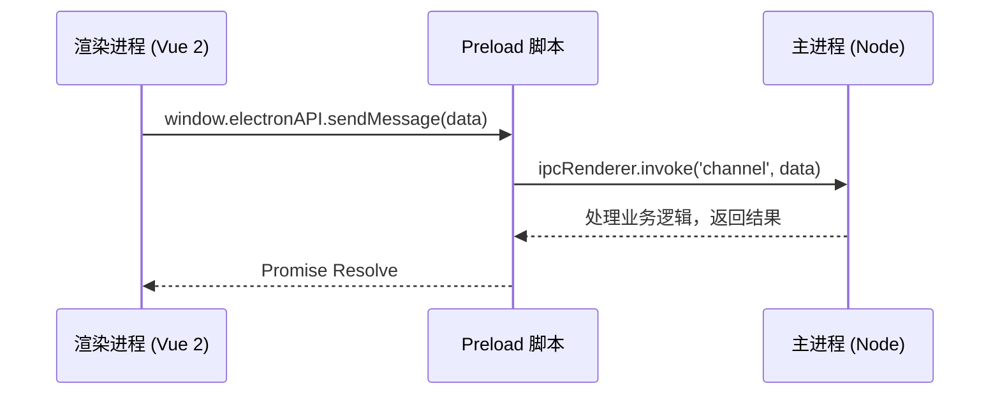

# Electron 8 + Vue 2 最佳实践与 linux&mac 桌面端架构设计

> **前言**：本文基于 **Electron 8**、**Vue 2** 及 **JavaScript** 生态，探讨在经典技术栈下的 Electron 架构设计。我们将以一个高安全、高稳定性的“linux&mac 桌面端”项目为例，剖析从底层通信到业务模块（IM、音视频、会议）的完整架构实现。

## 一、Electron 核心原理与架构解析

Electron 的本质是将 **Chromium**（负责渲染与 UI）与 **Node.js**（负责系统底层交互）通过 **Native APIs** 融合在一起。

### 1.1 多进程架构模型

Electron 采用多进程架构，主要分为 **主进程 (Main Process)** 和 **渲染进程 (Renderer Process)**。

- **主进程 (Main Process)**：
  - 拥有完整的 Node.js 环境。
  - 负责应用生命周期管理 (`app`)、窗口管理 (`BrowserWindow`)。
  - **核心职责**：作为大管家，负责调度资源、管理窗口、处理系统级事件。
- **渲染进程 (Renderer Process)**：
  - 基于 Chromium 的 Web 页面。
  - 负责 UI 渲染与用户交互。
  - **安全与能力**：在 Electron 8 中，默认 `nodeIntegration` 为 `false`（但常被开发者手动开启），`contextIsolation` 默认也为 `false`。
  - **最佳实践**：即使在 Electron 8，为了安全性，我们也强烈建议 **关闭 `nodeIntegration`** 并 **开启 `contextIsolation`**，通过 `preload.js` 暴露能力。

### 1.2 IPC 通信机制

在 Electron 8 中，虽然 `remote` 模块依然可用且流行，但由于其性能低下和安全隐患，**最佳实践是使用 IPC 进行通信**。Electron 7 引入了 `ipcRenderer.invoke` 和 `ipcMain.handle`，这使得双向通信变得像 `async/await` 一样简单，完全可以替代 `remote`。

- **ipcMain**：主进程监听。
- **ipcRenderer**：渲染进程发送。
- **ContextBridge**：在 `preload.js` 中安全地暴露 API。

**通信流程图解**：



---

## 二、linux&mac 桌面端项目架构设计

本项目采用 **Electron 8 + Vue 2 + Vuex + SQLite** 技术栈。

### 2.1 总体架构图

```mermaid
graph TD
    subgraph "渲染层 (Renderer)"
        UI[Element UI (Vue 2)]
        Store[Vuex 状态管理]
        Router[Vue Router]
        Worker[Web Worker (解密/计算)]
    end

    subgraph "中介层 (Preload)"
        API[ContextBridge 暴露 API]
        Safe[安全过滤与校验]
    end

    subgraph "主进程 (Main)"
        WinMgr[窗口管理器]
        Update[自动更新 (私有源)]
        Native[C++ Addons (截图/录屏)]

        subgraph "核心服务"
            DB[SQLite (better-sqlite3)]
            Net[Axios/WebSocket]
            Log[日志系统]
        end
    end

    UI --> API
    API --> WinMgr
    API --> DB
    API --> Net
```

### 2.2 核心模块设计

#### 1. 聊天系统 (IM)

- **数据存储**：使用 `better-sqlite3` 在主进程封装数据库操作。
- **消息同步**：
  - **推拉结合**：WebSocket 推送通知，HTTP 拉取离线消息。
  - **Vuex 集成**：渲染进程收到消息后，存入 Vuex Store 进行响应式更新。
- **大文件传输**：利用 Node.js `fs` 模块在主进程处理流式读写。

#### 2. 音视频通话 (1v1)

- **技术选型**：WebRTC。
- **窗口策略**：通话界面使用独立 `BrowserWindow`。
- **通信**：通过主进程转发信令，实现多窗口间的状态同步。

#### 3. 多人会议系统

- **架构模式**：SFU 架构。
- **屏幕共享**：使用 Electron 的 `desktopCapturer` 获取流（Electron 8 API 略有不同，需注意 `sources` 获取方式）。
- **多窗口协作**：主会场、控制条、PPT 演示分属不同窗口。

---

## 三、关键技术实现与代码示例

### 3.1 安全通信最佳实践 (Preload)

**主进程 (main.js)**:

```javascript
const { app, BrowserWindow, ipcMain } = require("electron");
const db = require("./database");

// 监听渲染进程的数据库查询请求
ipcMain.handle("db:query-messages", async (event, sessionId) => {
  // 可以在这里做权限校验
  return db
    .prepare("SELECT * FROM messages WHERE session_id = ?")
    .all(sessionId);
});
```

**Preload 脚本 (preload.js)**:

```javascript
const { contextBridge, ipcRenderer } = require("electron");

contextBridge.exposeInMainWorld("electronAPI", {
  // 只暴露必要的业务方法
  getMessages: (sessionId) =>
    ipcRenderer.invoke("db:query-messages", sessionId),

  // 接收主进程推送的消息
  onNewMessage: (callback) => {
    const subscription = (_event, msg) => callback(msg);
    ipcRenderer.on("im:new-message", subscription);
    // 返回取消订阅函数，方便 Vue 组件销毁时解绑
    return () => ipcRenderer.removeListener("im:new-message", subscription);
  },
});
```

**渲染进程 (Chat.vue - Vue 2 Options API)**:

```javascript
<template>
  <div class="chat-container">
    <div v-for="msg in messages" :key="msg.id">{{ msg.content }}</div>
  </div>
</template>

<script>
export default {
  name: 'Chat',
  data() {
    return {
      messages: [],
      unsubscribe: null
    };
  },
  methods: {
    async loadMessages(sessionId) {
      try {
        // 调用 preload 暴露的 API
        this.messages = await window.electronAPI.getMessages(sessionId);
        console.log('历史消息:', this.messages);
      } catch (error) {
        console.error('加载消息失败:', error);
      }
    }
  },
  mounted() {
    // 监听新消息
    this.unsubscribe = window.electronAPI.onNewMessage((msg) => {
      this.messages.push(msg);
    });

    // 初始化加载
    this.loadMessages('session_123');
  },
  beforeDestroy() {
    // 组件销毁前取消监听，防止内存泄漏
    if (this.unsubscribe) {
      this.unsubscribe();
    }
  }
};
</script>
```

### 3.2 多窗口管理 (Window Manager)

```javascript
// main/managers/WindowManager.js
const { BrowserWindow } = require("electron");
const path = require("path");

class WindowManager {
  constructor() {
    this.windows = new Map();
  }

  createWindow(type, params = {}) {
    // 如果已存在，直接聚焦
    if (this.windows.has(type) && type === "main") {
      const win = this.windows.get(type);
      if (win) {
        if (win.isMinimized()) win.restore();
        win.focus();
        return;
      }
    }

    const win = new BrowserWindow({
      width: type === "meeting" ? 1280 : 1000,
      height: 800,
      webPreferences: {
        preload: path.join(__dirname, "../preload/index.js"),
        // Electron 8 最佳实践：开启隔离，禁用 Node 集成
        contextIsolation: true,
        nodeIntegration: false,
      },
    });

    // 开发环境与生产环境 URL 处理 (Vue CLI 通常使用 localhost:8080)
    const url = process.env.WEBPACK_DEV_SERVER_URL
      ? `${process.env.WEBPACK_DEV_SERVER_URL}#/${type}`
      : `file://${path.join(__dirname, "../dist/index.html")}#/${type}`;

    win.loadURL(url);

    // 注册到 Map
    const id = type === "chat" ? `chat_${params.id}` : type;
    this.windows.set(id, win);

    win.on("closed", () => this.windows.delete(id));
  }
}

module.exports = WindowManager;
```

### 3.3 历史消息滚动设计 (虚拟滚动)

在政务沟通场景中，历史消息往往巨大（以万级数据进行设计）。若直接渲染所有 DOM 节点，会导致内存飙升和页面卡顿。最佳实践是采用 **虚拟滚动 (Virtual Scrolling)** 技术，仅渲染可视区域内的消息。

**技术选型**：`vue-virtual-scroller` (Vue 2 生态成熟方案)

**实现逻辑**：

1.  **动态高度计算**：聊天气泡高度不固定，需预估高度或使用 `DynamicScroller`。
2.  **分页加载**：滚动到顶部时，通过 IPC 请求上一页历史消息。
3.  **滚动锚定**：加载旧消息后，保持滚动条位置不变。

**代码示例 (ChatWindow.vue)**：

```html
<template>
  <div class="chat-window">
    <!-- DynamicScroller 支持不定高度项 -->
    <DynamicScroller
      ref="scroller"
      :items="messages"
      :min-item-size="60"
      class="scroller"
      @scroll.native="onScroll"
    >
      <template v-slot="{ item, index, active }">
        <DynamicScrollerItem
          :item="item"
          :active="active"
          :size-dependencies="[item.content]"
          :data-index="index"
        >
          <div class="message-bubble" :class="{ 'self': item.isSelf }">
            <div class="avatar">{{ item.sender[0] }}</div>
            <div class="content">{{ item.content }}</div>
          </div>
        </DynamicScrollerItem>
      </template>
    </DynamicScroller>
  </div>
</template>

<script>
  import { DynamicScroller, DynamicScrollerItem } from "vue-virtual-scroller";
  import "vue-virtual-scroller/dist/vue-virtual-scroller.css";

  export default {
    components: { DynamicScroller, DynamicScrollerItem },
    data() {
      return {
        messages: [], // 消息列表
        isLoading: false,
        isAllLoaded: false,
      };
    },
    methods: {
      async onScroll(e) {
        // 滚动到顶部加载更多
        if (e.target.scrollTop === 0 && !this.isLoading && !this.isAllLoaded) {
          await this.loadMoreMessages();
        }
      },
      async loadMoreMessages() {
        this.isLoading = true;
        const firstMsgId = this.messages[0]?.id;

        // 记录加载前的滚动高度
        const scroller = this.$refs.scroller.$el;
        const oldHeight = scroller.scrollHeight;

        // 通过 IPC 获取历史消息 (模拟)
        const newMessages = await window.electronAPI.getHistoryMessages(
          firstMsgId,
          20
        );

        if (newMessages.length > 0) {
          // 头部插入
          this.messages = [...newMessages, ...this.messages];

          // 保持滚动位置锚定
          this.$nextTick(() => {
            const newHeight = scroller.scrollHeight;
            scroller.scrollTop = newHeight - oldHeight;
          });
        } else {
          this.isAllLoaded = true;
        }

        this.isLoading = false;
      },
    },
  };
</script>

<style scoped>
  .scroller {
    height: 100%;
    overflow-y: auto;
  }
</style>
```

---

## 四、性能优化与安全策略

### 4.1 启动速度优化

- **V8 Snapshot**: 使用 `v8-compile-cache`。
- **延迟加载**: 使用 `require` 动态加载非核心模块。
- **Webpack 优化**: 针对 Vue 2 项目，使用 `DllPlugin` 预编译 Vendor 库（Vue, Vuex, ElementUI）。

### 4.2 内存管理

- **大图处理**: 列表页使用缩略图，详情页懒加载原图。
- **Web Worker**: 将国密算法（SM2/3/4）放入 Worker 线程。

### 4.3 安全策略 (Security)

- **禁用 Node Integration**: 即使在 Electron 8，也应坚决关闭 `nodeIntegration`。
- **Remote 模块**: **慎用** `enableRemoteModule: true`。虽然 Electron 8 内置了 remote，但为了性能和安全，建议使用 `ipcMain.handle` 替代。
- **CSP**: 配置严格的 Content Security Policy。

## 五、Linux & macOS 桌面端兼容性挑战

在跨平台开发中，Linux 和 macOS 的系统差异是不可忽视的痛点。以下为兼容性问题及解决方案。

### 5.1 系统托盘 (Tray) 行为差异

**问题描述**：

- **macOS**: 托盘图标支持自动适应浅色/深色模式（Template Image），但点击行为通常是弹出菜单，不支持双击事件。
- **Linux**: 严重依赖 `libappindicator`。不同桌面环境（如 GNOME 3+）默认可能隐藏托盘，且图标尺寸限制严格（通常 22x22 或 24x24），过大图标会被裁剪或显示异常。

**解决方案**：
针对不同平台加载不同尺寸和类型的图标，并定制交互逻辑。

```javascript
const { Tray, Menu, nativeImage } = require("electron");
const path = require("path");

let tray = null;

function createTray(win) {
  let iconPath;
  if (process.platform === "darwin") {
    // macOS 使用 Template image (文件名以 Template 结尾) 自动适配黑白模式
    iconPath = path.join(__dirname, "../assets/iconTemplate.png");
  } else {
    // Linux 建议使用 png，且尺寸不宜过大
    iconPath = path.join(__dirname, "../assets/icon_24x24.png");
  }

  tray = new Tray(iconPath);

  const contextMenu = Menu.buildFromTemplate([
    { label: "显示主界面", click: () => win.show() },
    { label: "退出", click: () => app.quit() },
  ]);

  tray.setToolTip("linux&mac桌面端");
  tray.setContextMenu(contextMenu);

  // Linux/Windows 支持点击事件，macOS 通常只响应右键菜单
  if (process.platform !== "darwin") {
    tray.on("click", () => {
      win.isVisible() ? win.hide() : win.show();
    });
  }
}
```

## 六、总结

在 Electron 8 + Vue 2 的经典架构下，我们依然可以通过遵循现代 Electron 的安全规范（Context Isolation + IPC Invoke）来构建高质量的应用。通过将业务逻辑下沉到主进程，利用 Node.js 的强大能力处理数据库和网络 IO，配合 Vue 2 成熟的组件生态，能够交付稳定可靠的政务级解决方案。
