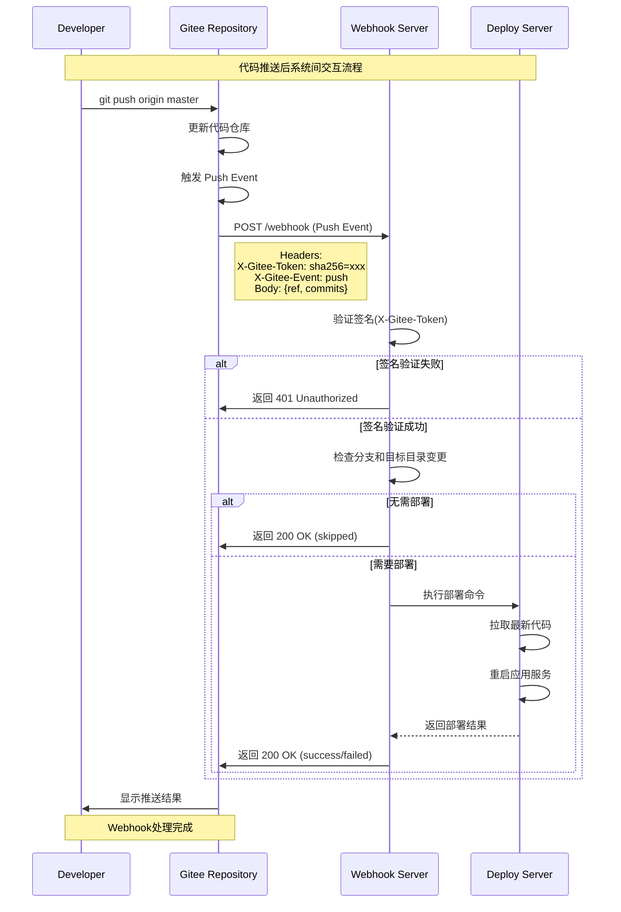
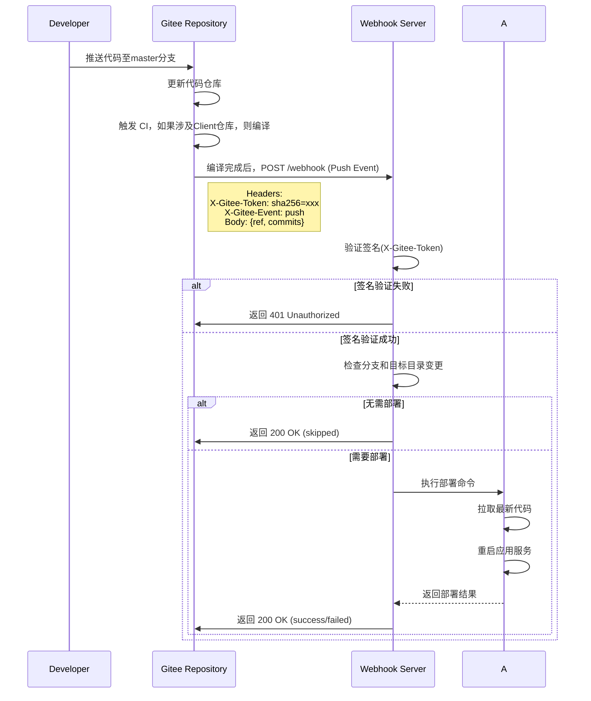
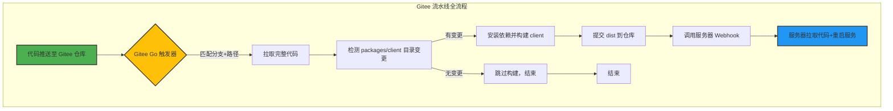

## 🏗️ 自动化部署核心架构

> 为了不将服务器账密泄漏给 gitee/github，本文使用经典的 Webhook-Triggered CI/CD 模式，实现自动化部署流程：

1.  **代码提交：** 开发者将代码推送到 Git 仓库。
2.  **Webhook 触发：** Git 仓库自动发送 HTTP POST 请求（Webhook）到腾讯云 CVM 的指定端口。
3.  **Webhook Server 监听：** CVM 上的 Node.js 服务接收到请求。
4.  **执行脚本：** Node.js 服务运行预设的 Shell 脚本。
5.  **部署动作：** Shell 脚本执行 `git pull`、`npm install`、`npm run build` 和部署操作。
6.  **项目更新：** 新的 Vue 3 构建产物上线，通过 Nginx 暴露给用户。

### **✨ Webhook 交互流程**

执行时序，代码推送后，系统、仓库、服务器



## 🛠️ 第一步：服务器基础环境配置

### 1. 准备工作

- **腾讯云 CVM (Linux)** 一台。
- **安装 Git、Node.js 和 PM2：**
  ```bash
  # 安装 Node.js (推荐使用 nvm 管理版本)
  sudo apt install nodejs npm -y
  # 安装 PM2 (用于保持 Node.js Webhook 服务和前端应用稳定运行)
  npm install pm2 -g
  sudo apt install git -y
  ```

### 2. 配置 SSH 免密拉取代码

为了让服务器无需密码即可拉取代码，需要配置 SSH 密钥：

1.  **生成密钥：** 在 CVM 上执行 `ssh-keygen -t rsa -C "your_email@example.com"`，一路回车，生成公钥和私钥。
2.  **添加公钥：** 将生成的公钥文件内容 (`~/.ssh/id_rsa.pub`) 复制。
3.  **配置仓库：** 登录 Gitee 或 GitHub，进入**目标仓库**的 **设置 -\> 部署公钥管理 (Gitee) / Deploy Keys (GitHub)**，将公钥粘贴进去并保存。

## 第二步：Webhook 服务搭建

使用 NestJS 9.x 实现 Webhook 服务（支持 Lerna Monorepo 目录过滤），专为 Lerna Monorepo 环境设计，支持指定目录变更过滤。

### 项目结构

```bash
nest-webhook/
├── src/
│   ├── app.module.ts          # 主模块
│   ├── main.ts                # 入口文件
│   ├── webhook/
│   │   ├── webhook.controller.ts  # Webhook 控制器
│   │   ├── webhook.module.ts      # Webhook 模块
│   │   ├── webhook.service.ts     # Webhook 服务
│   │   └── dto/               # 数据传输对象
│   │       └── webhook.dto.ts
│   └── deploy/
│       ├── deploy.service.ts  # 部署服务
│       └── deploy.module.ts   # 部署模块
├── .env.example               # 环境变量示例
├── package.json
└── tsconfig.json
```

### 实现步骤

#### 1. 创建 NestJS 项目

```bash
npm i -g @nestjs/cli
nest new nest-webhook
cd nest-webhook
npm install @nestjs/config dotenv crypto child_process axios
```

#### 2. 环境变量配置 (.env)

```env.dev
WEBHOOK_SECRET=vue3-deploy-secret-123
REPO_PATH=/opt/vue3-app/your-monorepo
BUILD_CMD=npm install && npm run build --workspace=web
DEPLOY_PATH=/opt/vue3-app/your-monorepo/packages/web/dist
WATCH_DIRS=packages/web/
TARGET_BRANCH=refs/heads/master
PORT=3000
```

#### 3. 核心代码实现

##### src/app.module.ts

```typescript
import { Module } from "@nestjs/common";
import { ConfigModule } from "@nestjs/config";
import { WebhookModule } from "./webhook/webhook.module";
import { DeployModule } from "./deploy/deploy.module";
const envFilePath = `.env.${process.env.NODE_ENV || "prod"}`;

@Module({
  imports: [
    ConfigModule.forRoot({
      isGlobal: true,
      envFilePath,
      cache: true, // 启用缓存提高性能
    }),
    WebhookModule,
    DeployModule,
  ],
})
export class AppModule {}
```

##### src/main.ts

```typescript
import { NestFactory } from "@nestjs/core";
import { ValidationPipe } from "@nestjs/common";
import { AppModule } from "./app.module";
import { Logger } from "@nestjs/common";

async function bootstrap() {
  const app = await NestFactory.create(AppModule);

  // app.useGlobalPipes(new ValidationPipe({
  //   whitelist: true,
  //   forbidNonWhitelisted: false, // 改为 false 允许额外属性
  //   transform: true, // 自动转换类型
  //   skipMissingProperties: true, // 跳过缺失属性
  // }));

  const port = process.env.PORT || 3002;
  await app.listen(port);
  Logger.log(
    `🚀 Webhook server running on http://localhost:${port}`,
    "Bootstrap"
  );
}
bootstrap();
```

##### src/webhook/dto/webhook.dto.ts

```typescript
export class WebhookDto {
  readonly ref: string;
  readonly before: string;
  readonly after: string;
  readonly commits: Array<{
    id: string;
    message: string;
    added: string[];
    modified: string[];
    removed: string[];
    author: {
      name: string;
      email: string;
    };
    timestamp: string;
  }>;
  readonly repository: {
    name: string;
    url: string;
    homepage: string;
  };
  readonly sender: {
    login: string;
    id: number;
    avatar_url: string;
    url: string;
  };
}
```

##### src/webhook/webhook.service.ts

```typescript
import { Injectable, Logger } from "@nestjs/common";
import { ConfigService } from "@nestjs/config";
import * as crypto from "crypto";
import { WebhookDto } from "./dto/webhook.dto";
const querystring = require("querystring");

@Injectable()
export class WebhookService {
  private readonly logger = new Logger(WebhookService.name);

  constructor(private configService: ConfigService) {}

  /**
   * 生成 Gitee 风格的签名
   * @param {string} secret 密钥
   * @returns {object} { timestamp, signature }
   */
  generateSignature(secret) {
    const timestamp = Date.now();
    const stringToSign = `${timestamp}\n${secret}`;

    const hmac = crypto.createHmac("sha256", secret);
    hmac.update(stringToSign);

    const signData = hmac.digest();
    const base64Sign = signData.toString("base64");
    const urlEncodedSign = querystring.escape(base64Sign);

    return { timestamp, signature: urlEncodedSign };
  }

  /**
   * 验证 Gitee 签名
   * @param {number} timestamp 时间戳
   * @param {string} receivedSignature 接收到的签名
   * @param {number} tolerance 时间容差（毫秒，默认5分钟）
   * @returns {boolean} 是否有效
   */
  verifySignature(timestamp, receivedSignature, tolerance = 3600000) {
    // 1. 检查时间戳是否在有效范围内
    const currentTimestamp = Date.now();
    if (Math.abs(currentTimestamp - timestamp) > tolerance) {
      console.warn("Signature expired or timestamp invalid");
      return false;
    }

    const secret = this.configService.get<string>("WEBHOOK_SECRET");
    // 2. 重新计算签名
    const stringToSign = `${timestamp}\n${secret}`;
    const hmac = crypto.createHmac("sha256", secret);
    hmac.update(stringToSign);
    const signData = hmac.digest();
    const expectedBase64 = signData.toString("base64");
    const expectedSignature = querystring.escape(expectedBase64);

    // 3. 安全比较签名
    return this.safeCompare(receivedSignature, expectedSignature);
  }

  /**
   * 安全比较两个字符串（防止时序攻击）
   */
  safeCompare(a, b) {
    if (a.length !== b.length) return false;

    const bufA = Buffer.from(a);
    const bufB = Buffer.from(b);

    return crypto.timingSafeEqual(bufA, bufB);
  }

  isWatchDirChanged(commits: WebhookDto["commits"]): boolean {
    const watchDirs = this.configService.get<string>("WATCH_DIRS").split(",");

    for (const commit of commits) {
      const changedFiles = [
        ...(commit.added || []),
        ...(commit.modified || []),
        ...(commit.removed || []),
      ];

      for (const file of changedFiles) {
        for (const dir of watchDirs) {
          const normalizedDir = dir.endsWith("/") ? dir : `${dir}/`;
          if (file.startsWith(normalizedDir)) {
            this.logger.log(
              `Detected change in watch dir: ${file} (dir: ${dir})`
            );
            return true;
          }
        }
      }
    }

    return false;
  }
}
```

##### src/webhook/webhook.controller.ts

```typescript
import {
  Controller,
  Post,
  Body,
  Headers,
  HttpException,
  HttpStatus,
  Logger,
} from "@nestjs/common";
import { WebhookService } from "./webhook.service";
import { DeployService } from "../deploy/deploy.service";
import { WebhookDto } from "./dto/webhook.dto";

@Controller("webhook")
export class WebhookController {
  private readonly logger = new Logger(WebhookController.name);

  constructor(
    private readonly webhookService: WebhookService,
    private readonly deployService: DeployService
  ) {}

  @Post()
  async handleWebhook(
    @Body() payload: WebhookDto,
    @Headers("x-gitee-token") signature: string,
    @Headers("x-gitee-event") eventType: string
  ) {
    try {
      // 1. 验证事件类型
      if (eventType !== "push") {
        this.logger.warn(`Ignored event: ${eventType}`);
        throw new HttpException(
          `Unsupported event type: ${eventType}`,
          HttpStatus.BAD_REQUEST
        );
      }

      // 2. 验证签名
      if (!this.webhookService.verifySignature(payload, signature)) {
        this.logger.warn("Invalid signature received");
        throw new HttpException("Invalid signature", HttpStatus.FORBIDDEN);
      }

      // 3. 检查分支
      const targetBranch = process.env.TARGET_BRANCH || "refs/heads/master";
      if (payload.ref !== targetBranch) {
        this.logger.log(
          `Skipped non-target branch: ${payload.ref} (target: ${targetBranch})`
        );
        return { status: "skipped", reason: "non-target-branch" };
      }

      // 4. 检查变更文件
      if (!payload.commits || payload.commits.length === 0) {
        this.logger.log("No commits in push event");
        return { status: "skipped", reason: "no-commits" };
      }

      const hasWatchDirChange = this.webhookService.isWatchDirChanged(
        payload.commits
      );
      if (!hasWatchDirChange) {
        this.logger.log(
          `No changes in watched directories: ${process.env.WATCH_DIRS}`
        );
        return { status: "skipped", reason: "no-watched-changes" };
      }

      // 5. 执行部署
      this.logger.log("Starting deployment...");
      const result = await this.deployService.deploy();

      return {
        status: "success",
        message: "Deployment completed successfully",
        details: result,
      };
    } catch (error) {
      this.logger.error(
        `Webhook processing failed: ${error.message}`,
        error.stack
      );
      throw new HttpException(
        error.response || "Internal server error",
        error.status || HttpStatus.INTERNAL_SERVER_ERROR
      );
    }
  }
}
```

##### src/deploy/deploy.service.ts

```typescript
import { Injectable, Logger } from "@nestjs/common";
import { ConfigService } from "@nestjs/config";
import { exec } from "child_process";
import { promisify } from "util";

const execAsync = promisify(exec);

@Injectable()
export class DeployService {
  private readonly logger = new Logger(DeployService.name);

  constructor(private configService: ConfigService) {}

  async deploy(): Promise<{ stdout: string; stderr: string }> {
    const repoPath = this.configService.get<string>("REPO_PATH");
    const buildCmd = this.configService.get<string>("BUILD_CMD");

    this.logger.log(`Executing deployment in ${repoPath}`);
    this.logger.log(`Build command: ${buildCmd}`);

    try {
      // 1. 拉取最新代码
      this.logger.log("Pulling latest code...");
      await execAsync("git pull", { cwd: repoPath });

      // 2. 执行构建命令
      this.logger.log("Building project...");
      const { stdout, stderr } = await execAsync(buildCmd, { cwd: repoPath });

      this.logger.log("Deployment completed successfully");
      this.logger.debug(`Build output: ${stdout}`);
      if (stderr) this.logger.warn(`Build warnings: ${stderr}`);

      return { stdout, stderr };
    } catch (error) {
      this.logger.error(`Deployment failed: ${error.message}`);
      this.logger.error(`Error output: ${error.stderr}`);
      throw error;
    }
  }
}
```

#### 4. 模块配置

##### src/webhook/webhook.module.ts

```typescript
import { Module } from "@nestjs/common";
import { WebhookController } from "./webhook.controller";
import { WebhookService } from "./webhook.service";
import { DeployModule } from "../deploy/deploy.module";
import { ConfigModule } from "@nestjs/config";

@Module({
  imports: [ConfigModule, DeployModule],
  controllers: [WebhookController],
  providers: [WebhookService],
})
export class WebhookModule {}
```

#### src/deploy/deploy.module.ts

```typescript
import { Module } from "@nestjs/common";
import { DeployService } from "./deploy.service";
import { ConfigModule } from "@nestjs/config";

@Module({
  imports: [ConfigModule],
  providers: [DeployService],
  exports: [DeployService],
})
export class DeployModule {}
```

#### 5. 部署到服务器

##### 安装 PM2 进程管理器

```bash
npm install pm2 -g
```

##### 创建 ecosystem.config.js

```javascript
module.exports = {
  apps: [
    {
      name: "nest-webhook",
      script: "dist/main.js",
      instances: "max",
      autorestart: true,
      watch: false,
      max_memory_restart: "1G",
      env: {
        NODE_ENV: "production",
      },
      env_production: {
        NODE_ENV: "production",
      },
    },
  ],
};
```

##### 构建并启动

```bash
npm run build
pm2 start ecosystem.config.js --env production
pm2 save
pm2 startup
```

### 6. Gitee Webhook 配置

1. 进入 Gitee 仓库 → 管理 → WebHooks → 添加 WebHook
2. URL: `http://your-server-ip:3000/webhook`
3. 事件: 选择 "推送事件"
4. Secret: 与 `.env` 中的 `WEBHOOK_SECRET` 一致
5. 点击添加
   > [gitee 签名计算方法说明](https://gitee.com/help/articles/4290#article-header2）

## 🎉 第三步：Nginx 配置与最终测试

由于 Vue 3 项目是静态文件，需要通过 Nginx 进行反向代理和托管。

1.  **安装 Nginx**（如果未安装）：`sudo apt install nginx -y`
2.  **配置 Nginx 虚拟主机：**

    ```nginx
    server {
        listen 80;
        server_name <您的域名或IP>; # 例如 example.com

        location / {
            # 指向您 Vue 3 构建后的 dist 目录
            root /home/www/my-vue3-app/dist;
            index index.html;
            try_files $uri $uri/ /index.html; # SPA 路由配置
        }
    }
    ```

3.  **重载 Nginx：** `sudo nginx -s reload`

## 🔧 第四步：测试与验证

### 1. 测试有效请求

```bash
curl -X POST http://localhost:3000/webhook \
  -H "Content-Type: application/json" \
  -H "X-Gitee-Token: sha256=计算出的签名" \
  -H "X-Gitee-Event: push" \
  -d '{
    "ref": "refs/heads/master",
    "commits": [
      {
        "added": ["packages/web/new-file.txt"],
        "modified": ["packages/web/src/App.vue"],
        "removed": []
      }
    ]
  }'
```

### 2. 测试无效请求

```bash
# 无效签名
curl -X POST http://localhost:3000/webhook \
  -H "Content-Type: application/json" \
  -H "X-Gitee-Token: invalid_signature" \
  -H "X-Gitee-Event: push" \
  -d '{}'

# 非推送事件
curl -X POST http://localhost:3000/webhook \
  -H "Content-Type: application/json" \
  -H "X-Gitee-Token: valid_signature" \
  -H "X-Gitee-Event: issue_created" \
  -d '{}'
```

## （非必须）高级功能扩展

### 1. 添加部署钩子

在 `deploy.service.ts` 中添加部署前后的钩子函数：

```typescript
async deploy(): Promise<any> {
  await this.beforeDeploy();

  const result = await this.executeDeployCommands();

  await this.afterDeploy(result);
  return result;
}

private async beforeDeploy() {
  this.logger.log('Running pre-deployment tasks...');
  // 备份当前版本、通知等
}

private async afterDeploy(result) {
  this.logger.log('Running post-deployment tasks...');
  // 清理缓存、发送通知等
}
```

## 总结

这个 NestJS 9.x 实现的 Webhook 服务具有以下特点：

1. **模块化设计**：清晰分离 Webhook 处理和部署逻辑
2. **Monorepo 支持**：通过目录过滤只构建变更的子项目
3. **安全可靠**：
   - 签名验证防止伪造请求
   - 环境变量管理敏感配置
   - 结构化错误处理
4. **可扩展性**：
   - 易于添加新的通知渠道
   - 支持部署前后钩子
   - 可配置构建命令和目标分支
5. **生产就绪**：
   - PM2 进程管理
   - 日志记录
   - 健康检查端点

通过这个实现，你可以轻松地在 Lerna Monorepo 环境中实现"仅当指定目录变更时才触发构建部署"的自动化流程，大幅提升开发效率和资源利用率。

## 问题

1. 由于腾讯云服务器资源有限 1C1G + 2C2G，编译非常吃资源，这里将编辑步骤放到 gitee 中，webhook 仅做 git pull 操作





<!-- gitee流水线脚本，仅参考，无法执行 -->

```shell
version: "1.0"
name: Client_Deploy
displayname: 前端编译

# 触发条件：只有 master 分支推送时才触发
triggers:
  - type: git_push
    branches: [master]

jobs:
  check-and-build:
    name: 检查变更并构建Client
    runs-on: ubuntu-latest
    # Gitee Go 支持的 Runner 类型
    steps:
      # 1. 拉取代码（完整历史，用于 diff）
      - name: 检出代码
        uses: actions/checkout@v4
        with:
          token: ${{ secrets.GITEE_TOKEN }}
          # 仓库私人令牌（需在 Gitee 密钥管理中配置）
          fetch-depth: 0
          # 拉取所有历史提交，确保 diff 可用

      # 2. 检查 packages/client 目录变更（使用 Gitee Go 内置 diff 工具）
      - name: 检测Client目录变更
        id: check_changes
        # 获取本次推送的变更文件（Gitee Go 内置环境变量）
        # GIT_PREVIOUS_COMMIT: 推送前的 commit ID（首次推送时为全零字符串）
        # GIT_COMMIT: 推送后的 commit ID
        run: |
          PREV_COMMIT="${{ env.GIT_PREVIOUS_COMMIT }}"
          CURRENT_COMMIT="${{ env.GIT_COMMIT }}"

          if [ "$PREV_COMMIT" = "0000000000000000000000000000000000000000" ]; then
            # 首次推送：检查所有提交的文件
            CHANGED_FILES=$(git diff-tree --no-commit-id --name-only -r $CURRENT_COMMIT)
          else
            # 常规推送：检查两次提交间的变更
            CHANGED_FILES=$(git diff --name-only $PREV_COMMIT $CURRENT_COMMIT)
          fi

          # 检查是否有 packages/client 下的文件变更
          CLIENT_CHANGED="false"
          while IFS= read -r file; do
            if [[ "$file" == packages/client/* ]]; then
              CLIENT_CHANGED="true"
              echo "检测到变更文件: $file"
              break
            fi
          done <<< "$CHANGED_FILES"

          # 设置步骤输出（Gitee Go 通过 ::set-output 接收）
          echo "client_changed=$CLIENT_CHANGED" >> $GITHUB_OUTPUT
          # 注意：Gitee Go 兼容 GitHub Actions 输出格式

      # 3. 仅当 Client 目录变更时执行构建
      - name: 构建并提交ClientDist
        if: ${{ steps.check_changes.outputs.client_changed == 'true' }}
        # 正确引用步骤输出
        run: |
          echo "===== 开始构建 packages/client ====="

          # 安装 pnpm（若未预装）
          npm install -g pnpm@8

          # 安装依赖（使用 pnpm workspace）
          pnpm install --frozen-lockfile

          # 仅构建 client 包（根据实际项目调整命令）
          cd packages/client && pnpm run build

          # 提交构建产物（dist 目录）
          git config --local user.name "Gitee CI"
          git config --local user.email "ci@gitee.com"
          git add packages/client/dist -f
          # 强制添加（覆盖 .gitignore）
          git commit -m "chore: update client dist [skip ci]"
          # [skip ci] 避免循环触发
          git push origin master
        env:
          GIT_AUTHOR_NAME: "Gitee CI"
          GIT_AUTHOR_EMAIL: "ci@gitee.com"
          GIT_COMMITTER_NAME: "Gitee CI"
          GIT_COMMITTER_EMAIL: "ci@gitee.com"

      # 4. 无变更时跳过构建（可选：添加日志）
      - name: 跳过构建通知
        if: ${{ steps.check_changes.outputs.client_changed == 'false' }}
        run: |
          echo "===== 未检测到 packages/client 变更，跳过构建 ====="
          echo "变更文件列表:"
          echo "${{ steps.check_changes.outputs.changed_files }}"
```
