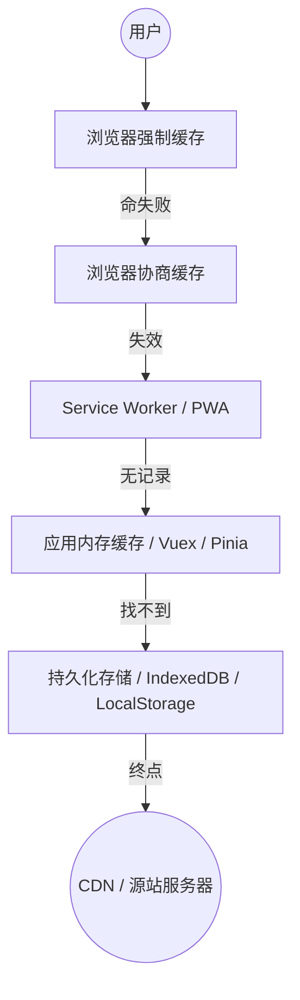
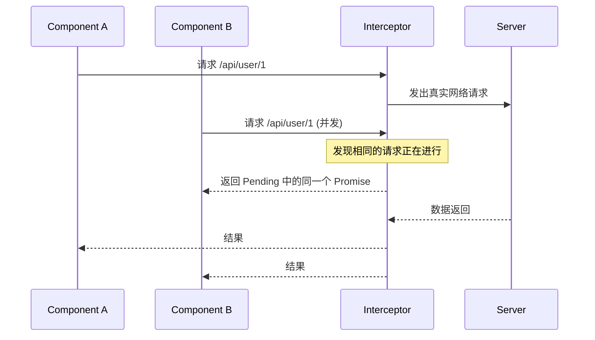

title: 2023-09-16-【优化】前端缓存最佳实践-示例
description: Web Workers 是通用的“后台计算线程”，Service Workers 是特殊的“网络代理线程”（专为 PWA 离线缓存、推送通知等场景设计）。
categories:

- 研发
  tags:
- web works
- service worker

在高性能 Web 应用的优化清单里，**缓存**永远是投入产出比（ROI）最高的一项。

从**浏览器缓存、应用级缓存、代码级缓存**三个维度，梳理一份干货满满的《前端缓存方案最佳实践》。

## 🚀 前端缓存全景架构

在进入代码细节前，我们先通过这张图建立全局视野。缓存的本质是：**越靠近用户，速度越快，成本越低。**



## 1. 浏览器 HTTP 缓存：性能的基石

这是最底层的缓存策略，由 Web 服务器控制。

### 强缓存（Strong Cache）

- **核心指令**：`Cache-Control: max-age=31536000` (HTTP/1.1)
- **表现**：浏览器直接从本地读取，状态码为 `200 (from disk cache)`，不发请求。
- **最佳实践**：**动静分离**。
- **静态资源（JS/CSS/Image）**：文件名带上 Content Hash（如 `main.a8f2c.js`），设置一年强缓存。
- **HTML 入口文件**：设置 `no-cache`，确保用户每次都能拿到最新的资源链接。

### 协商缓存（Negotiation Cache）

- **核心指令**：`ETag` / `If-None-Match`
- **表现**：浏览器发请求询问服务器“资源变了吗？”，若未变返回 `304 Not Modified`。
- **最佳实践**：配合强缓存使用。当强缓存过期，ETag 校验能避免重复下载未改变的资源。

## 2. 离线与预取缓存：Service Worker

Service Worker 是独立于主线程的“网络代理”，它是实现离线化和极致加载的关键。

- **策略选择**：

1. **Cache First**：适用于静态图标、字体。
2. **Stale-While-Revalidate**：**推荐方案**。优先使用缓存快速渲染，同时后台静默更新，下次进入页面即是最新版。
3. **Network First**：适用于对实时性要求极高的 API 请求。

## 3. 应用状态存储：内存与持久化

根据数据的**生命周期**和**体积**来抉择存储介质。

| 存储方式 | 容量 | 生命周期 | 适用场景 |
| | | -- | -- |
| **Pinia / Redux** | 内存限制 | 页面刷新即失 | 组件间共享状态、临时业务数据 |
| **LocalStorage** | ~5MB | 永久 | 用户偏好设置、简单的 Token |
| **SessionStorage** | ~5MB | 标签页关闭即失 | 单次会话数据、敏感的临时表单 |
| **IndexedDB** | 很大 (GB 级) | 永久 | 结构化大数据、离线文档、地图瓦片 |

### 🛠 最佳实践代码：带过期时间的 LocalStorage 封装

原生的 `localStorage` 没法设置过期时间，这在业务中很危险。

```javascript
const storage = {
  set(key, value, expireMinutes) {
    const data = {
      value,
      expire: expireMinutes ? Date.now() + expireMinutes * 60000 : null,
    };
    localStorage.setItem(key, JSON.stringify(data));
  },
  get(key) {
    const data = JSON.parse(localStorage.getItem(key));
    if (!data) return null;
    if (data.expire && Date.now() > data.expire) {
      localStorage.removeItem(key);
      return null;
    }
    return data.value;
  },
};
```

## 4. API 请求缓存：防抖与节流的进阶版

在复杂的 SaaS 应用中，同一个接口可能在 1 秒内被调用 5 次。

**方案：请求拦截器缓存 (Request Deduplication)**
在请求拦截器中，以 `Method + URL + Params` 为 Key。如果上一个相同请求还没结束，直接返回上一个请求的 Promise。



## 总结：“避坑”锦囊

1. **不要过度缓存 HTML**：HTML 如果被强缓存，你发布的新版本用户永远收不到。
2. **清理策略**：缓存不是只进不出的。在使用 IndexedDB 或 LocalStorage 时，务必设计版本号对比机制，版本更新时清空旧缓存。
3. **安全敏感**：严禁在 LocalStorage 存储个人敏感信息（身份证号、手机号），防止 XSS 攻击被一锅端。

## 问题集

1. **防御性编程**，（API 接口）禁用强缓存（Cache-Control: no-cache），避免返回旧数据；以 axios 为例：

- 1.1 全局拦截器注入 Header

```js
import axios from "axios";

const instance = axios.create();

instance.interceptors.request.use(
  (config) => {
    // 针对所有请求禁用强缓存
    config.headers["Cache-Control"] = "no-cache, no-store, must-revalidate";
    config.headers["Pragma"] = "no-cache"; // 兼容 HTTP/1.0
    config.headers["Expires"] = "0"; // 允许代理服务器立即过期

    return config;
  },
  (error) => {
    return Promise.reject(error);
  }
);
```

> 注：通常只需要对 GET 请求做处理，POST/PUT/DELETE 本身在语义上就是非幂等或改变数据的，浏览器默认不缓存。
> no-cache: 强制浏览器在使用缓存副本前先向服务器确认（协商缓存）。
> no-store: 禁止浏览器及所有中间代理存储任何缓存内容（彻底禁用缓存）。
> must-revalidate: 一旦资源过期，必须重新向源服务器校验。

- 1.2 URL 动态时间戳（最强制方案）
  有时即便设置了 Header，某些极其顽固的代理服务器仍可能返回缓存。此时，改变 URL 唯一性是终极杀招。

```js
instance.interceptors.request.use((config) => {
  // 仅针对 GET 请求添加随机参数
  if (config.method === "get") {
    config.params = {
      ...config.params,
      _t: Date.now(), // 或者使用 Math.random()
    };
  }
  return config;
});
```

> 原理：浏览器是以 URL（包括参数）作为缓存的 Key。
> 效果：每次请求的 URL 都是全新的（例如 /api/user?\_t=1734433221），浏览器无法从缓存库中匹配到该 Key，从而被迫发起网络请求。

- 1.3 服务端禁用缓存 nginx 配置

```json
location /api/ {
    add_header Cache-Control "no-cache, no-store, must-revalidate";
    proxy_pass http://your_backend;
}
```
