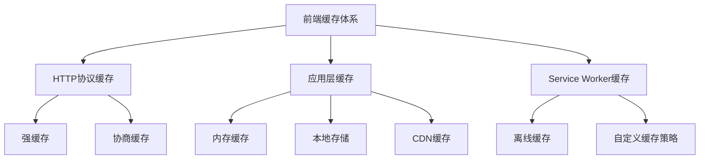
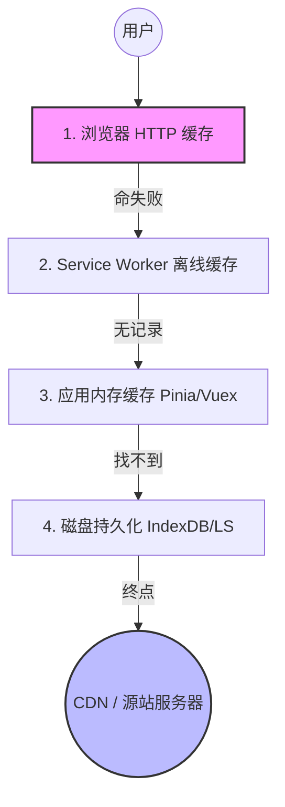
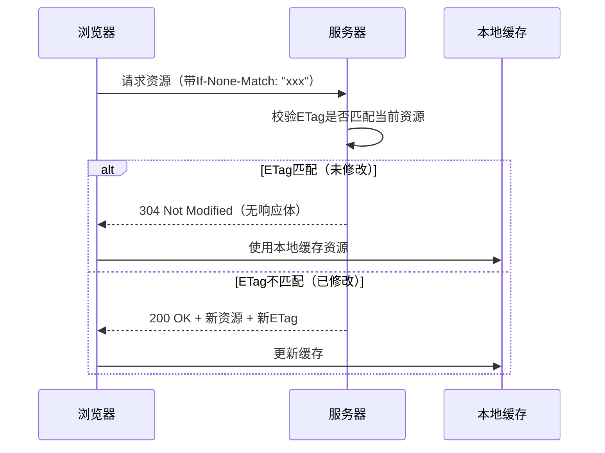
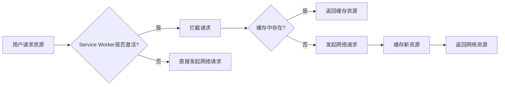
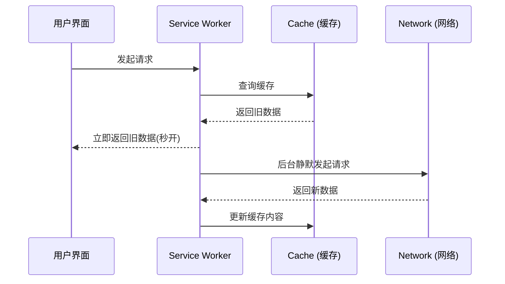

# 前端缓存方案最佳实践：从原理到落地

缓存是提升 Web 性能的“隐形引擎”——合理的缓存策略能减少网络请求、降低服务器压力、缩短首屏加载时间。本文将系统梳理前端缓存的核心方案，结合实战经验给出最佳实践。

## 一、为什么需要缓存？

前端缓存的本质是**空间换时间**：通过存储重复访问的资源副本，避免每次都从服务器获取。核心收益包括：

- 减少带宽消耗（尤其对移动端）
- 降低服务器负载（热点资源集中命中缓存）
- 提升用户体验（静态资源毫秒级响应）

## 二、前端缓存体系全景图

前端缓存可分为三个维度，覆盖从浏览器底层到业务代码的完整链路：



- 从物理层到逻辑层:**用空间换时间，用就近原则换响应速度。**



## 三、核心缓存方案详解与最佳实践

### 1. HTTP 协议缓存（浏览器自动处理）

HTTP 缓存是最基础的缓存机制，由浏览器根据响应头自动管理，分为**强缓存**和**协商缓存**。

#### 1.1 强缓存：直接复用本地副本

浏览器在请求前检查本地缓存是否“新鲜”，若未过期则直接使用，不发请求到服务器。

**核心响应头**：

- `Cache-Control: max-age=<seconds>`（优先级高于 Expires）：定义资源最大缓存时间（如`max-age=31536000`表示缓存 1 年）
- `Expires: <GMT时间>`：绝对过期时间（已被`Cache-Control`取代，不推荐单独使用）

**最佳实践**：

- 静态资源（JS/CSS/图片/字体）设置长缓存（如 1 年），但需配合**文件指纹**（hash/版本号）解决更新问题（见下文“缓存失效”）。
- 动态资源（API 接口）禁用强缓存（`Cache-Control: no-cache`），避免返回旧数据。

#### 1.2 协商缓存：与服务器确认有效性

当强缓存过期（或禁用强缓存），浏览器会携带缓存标识向服务器验证，若资源未修改则返回 304 Not Modified，继续使用本地缓存。

**核心标识**：

- **Last-Modified/If-Modified-Since**：基于文件最后修改时间（精度秒级，可能漏判短时间内的修改）
- **ETag/If-None-Match**：基于文件内容哈希（优先级更高，精准识别修改）

**最佳实践**：

- 优先使用`ETag`（如 Nginx 默认开启`etag on`，基于文件 inode/mtime/size 生成），避免`Last-Modified`的时间精度问题。
- API 接口可配置协商缓存（如用户信息接口），减少重复数据传输。

**协商缓存判断逻辑**



### 2. Service Worker 缓存（PWA 核心技术）

Service Worker（SW）是运行在浏览器后台的脚本，可拦截网络请求、实现离线缓存，是 PWA（渐进式 Web 应用）的核心能力。

如果说 HTTP 缓存是自动化的，那么 Service Worker (SW) 就是**手动挡**。它让前端拥有了拦截网络请求并决定“给缓存还是给网络”的权利。

#### 2.1 核心能力

- 离线访问：缓存关键资源（HTML/CSS/JS），断网时仍可打开应用。
- 自定义缓存策略：按资源类型（如图片缓存 7 天，API 缓存 1 小时）灵活配置。

#### 2.2 实现步骤（简化版）

1. 注册 SW：`navigator.serviceWorker.register('/sw.js')`
2. SW 安装时缓存核心资源：

```javascript
// sw.js
const CACHE_NAME = "my-app-v1";
const ASSETS_TO_CACHE = ["/", "/index.css", "/app.js", "/logo.png"];

self.addEventListener("install", (event) => {
  event.waitUntil(
    caches.open(CACHE_NAME).then((cache) => cache.addAll(ASSETS_TO_CACHE))
  );
});
```

3. 拦截请求并返回缓存：

```javascript
self.addEventListener("fetch", (event) => {
  event.respondWith(
    caches.match(event.request).then((cachedResponse) => {
      // 缓存命中则返回，同时后台更新缓存（ stale-while-revalidate策略）
      return (
        cachedResponse ||
        fetch(event.request).then((response) => {
          caches
            .open(CACHE_NAME)
            .then((cache) => cache.put(event.request, response.clone()));
          return response;
        })
      );
    })
  );
});
```

**最佳实践**：
最推荐的策略是 **Stale-While-Revalidate (过时即重新校验)**。

- **逻辑流**：

1. 用户发起请求，SW 立即返回旧缓存（秒开页面）。
2. 同时 SW 在后台静默发起网络请求，拿到新数据并更新缓存。
3. 用户下次刷新，看到的即是最新内容。

- **适用场景**：非实时性的静态资源，如 Avatar、公共库、CSS。





### 3. 应用层缓存（代码主动控制）

除 HTTP 缓存外，业务代码中可通过内存、本地存储等方式实现更灵活的缓存。

#### 3.1 内存缓存：短期高频数据：Pinia / Redux / Vuex

这是我们在业务开发中最常操作的一层，数据存在内存里，读写速度达到微秒级。

- **状态共享**：解决组件通信的痛苦。
- **防抖重复请求**：在架构层面，我们可以给 Store 增加一个 `loading` 状态或 `timestamp`。如果数据在 1 分钟内更新过，直接读取内存，不再触发 Action 里的 API 请求。
- **坑点提示**：内存缓存**“随页而亡”**。F5 一刷，万物皆空。因此对于关键数据，必须配合**持久化**。

利用 JavaScript 变量（如对象、Map）存储临时数据，生命周期与页面一致（刷新即失效），适合**高频访问的小数据**（如组件状态、临时计算结果）。

**最佳实践**：

- 仅缓存轻量数据（避免内存泄漏），设置容量上限（如 LRU 算法淘汰旧数据）,大数据 shallowref 浅拷贝响应式。

#### 2.2 本地存储：长期持久化数据

通过`localStorage`（持久化，5MB 限制）、`sessionStorage`（会话级，关闭标签页失效）存储非敏感数据，适合**配置项、用户偏好设置**等。

**注意**：

- 存储前序列化（`JSON.stringify`），读取时反序列化（`JSON.parse`）。
- 避免存储敏感信息（如 token，建议用`httpOnly cookie`）。

**最佳实践**：

- 给缓存加版本号（如`localStorage.setItem('config_v2', ...)`），升级时清除旧版本。

#### 2.3 CDN 缓存：边缘节点加速

CDN（内容分发网络）将静态资源缓存到全球边缘节点，用户就近访问，减少跨地域延迟。

**核心配置**：

- 静态资源 URL 添加版本号（如`logo-v2.png`），确保更新时 CDN 节点拉取新资源。
- 配置 CDN 缓存规则（如`Cache-Control: public, max-age=86400`），与源站缓存协同。

## 四、缓存失效与更新：避免“缓存地狱”

缓存最大的坑是“更新不及时”，以下是实战中总结的避坑指南：

### 1. 静态资源：文件指纹（Hash/版本号）

为静态资源 URL 添加唯一标识（如构建时生成的 content hash），资源内容变化时指纹变化，强制浏览器请求新资源。

**示例**：

```html
<!-- 未更新：logo.png -->


<!-- 更新后：logo.a1b2c3.png（指纹变化） -->

```

### 2. 动态资源：版本号/时间戳参数

API 接口可在 URL 后加版本号（`/api/user?v=2`）或时间戳（`/api/data?t=1620000000`），避免协商缓存导致的旧数据。

### 3. 缓存清理策略

- **手动清理**：提供“清除缓存”按钮（如设置页），调用`caches.delete(CACHE_NAME)`（SW 场景）或`localStorage.clear()`。
- **自动清理**：设置缓存过期时间（如 SW 中定期检查并删除超期缓存）。

## 五、总结：缓存策略组合拳

实际项目中，需根据资源类型组合使用缓存方案：

| 资源类型         | 推荐缓存方案                            | 缓存时长       | 更新策略               |
| ---------------- | --------------------------------------- | -------------- | ---------------------- |
| 静态 JS/CSS/图片 | HTTP 强缓存 + CDN 缓存 + 文件指纹       | 1 年           | 指纹变化触发更新       |
| API 接口数据     | HTTP 协商缓存（ETag）+ 内存缓存         | 按需（分钟级） | ETag 变化/主动刷新     |
| 用户配置         | localStorage（带版本号）                | 长期           | 版本号升级时清除旧缓存 |
| PWA 离线资源     | Service Worker 缓存（Cache First 策略） | 按资源重要性   | SW 更新时清理旧缓存    |

**核心原则**：

- 静态资源“长缓存+指纹”，动态资源“短缓存+协商”，敏感数据“不缓存”。
- 监控缓存命中率（通过 Chrome DevTools 的 Network 面板或 Lighthouse），持续优化策略。
