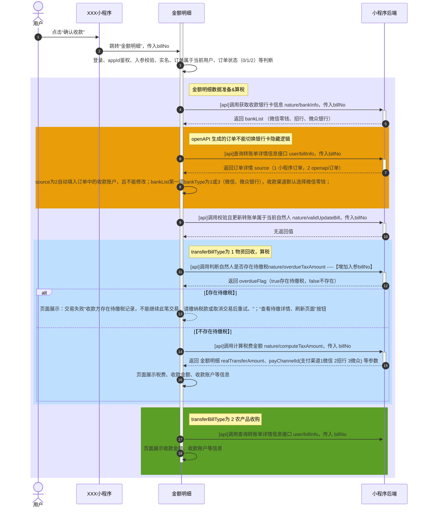
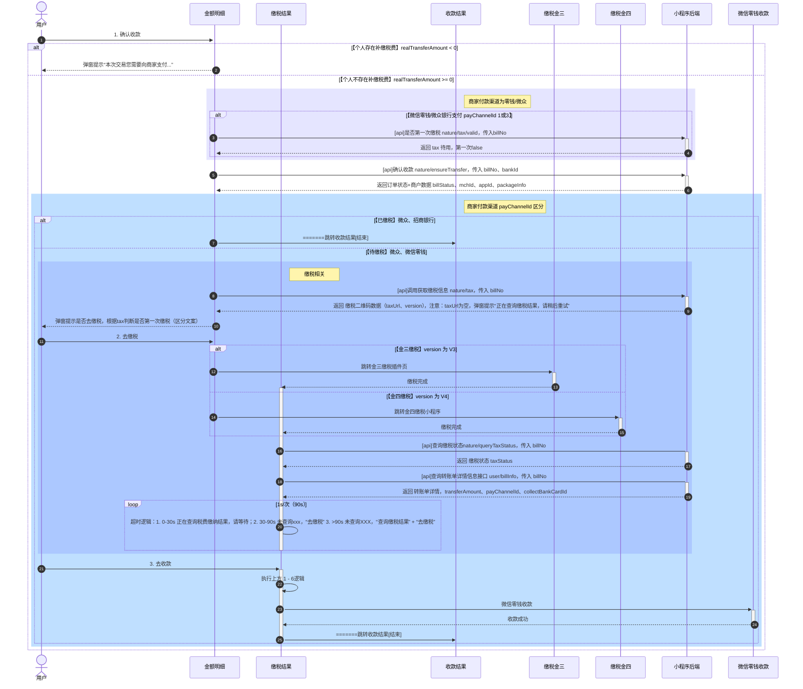

# 1. 需求背景说明

## 1.1 涉及页面

## 1.2 交互入口

# 2. 交互设计

- 示例 1

- 示例 2

# 3. 组件设计

## 3.1 组件名称

> 组件说明：
> 组件初始化时，xxx
> 操作 xxx

### UI 稿贴图

### 参数说明

- 入参：
  | 参数名 | 类型 | 默认值 | 描述 |
  | ----------- | ----------- |----------- |----------- |
  | edit-able | String | false | 是否可编辑（启用、禁用） |
  | click-able | Boolean | false | 是否可点击 |

- 事件：
  | 组件方法名 | 父组件接收方法（调用方） | 传参 | 描述 |
  | ----------- | ----------- |----------- |----------- |
  | onItemClick | item-click| {index: xx, itemId: xx} | 点击经办人列时触发 |
