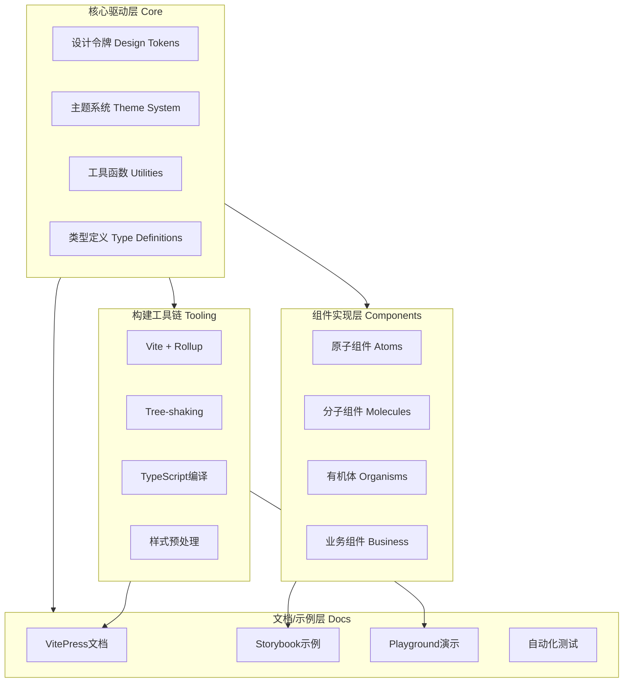
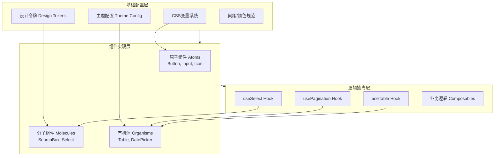
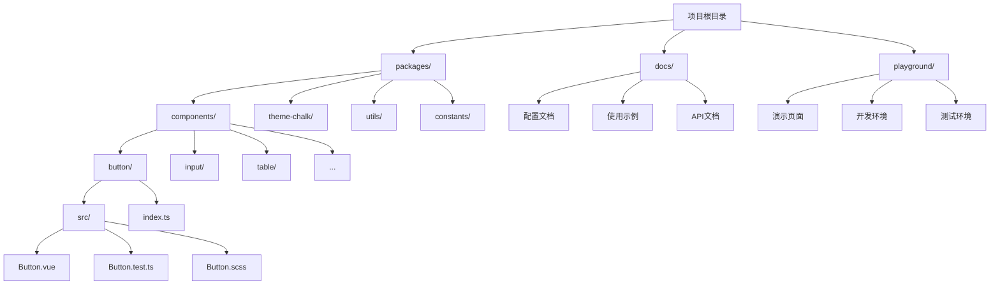
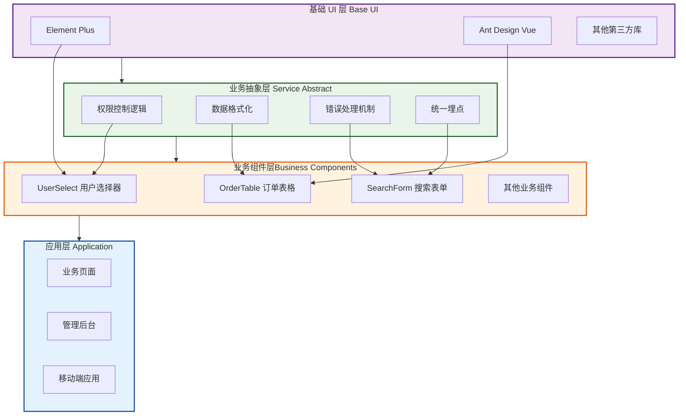
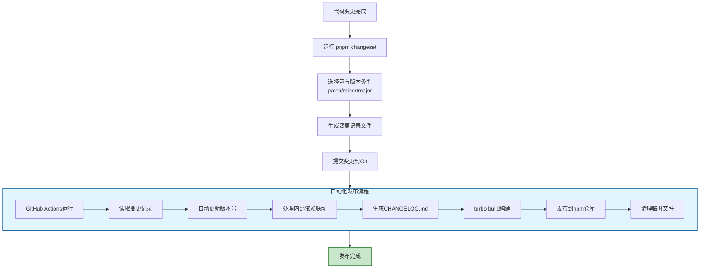

## 一、UI 组件库设计

在 Vue 生态中实现 UI 组件库架构设计，本质上是构建一套**可维护、可扩展且高性能的资产生产线**。

一个成熟的 UI 框架架构通常分为：**核心驱动层（Core）、组件实现层（Components）、构建工具链（Tooling）和文档/示例层（Docs）**。

---

### 1. 整体架构设计图



---

### 2. 核心架构分层



#### A. 基础配置层 (Core / Tokens)

不要在组件里写死颜色或间距。使用 **Design Tokens**（设计令牌）来管理视觉规范。

- **实现方式**：定义一套全局 CSS 变量或 SCSS/Less 变量。
- **功能**：支持**主题切换**（深色模式）、统一的圆角、阴影和间距标准。

#### B. 组件实现层 (Components)

采用"原子化"设计思路：

- **原子组件 (Atoms)**：Button, Input, Icon, Tag。
- **分子组件 (Molecules)**：SearchBox（Input + Button）, Select。
- **有机体 (Organisms)**：Table（包含 Checkbox, Pagination, Loading）, DatePicker。

#### C. 逻辑抽离 (Headless & Composables)

利用 Vue 3 的 **Composition API** 实现"无头（Headless）"逻辑。

- **思路**：将复杂的逻辑（如 Select 的选中、键盘导航、分页算法）抽离成独立的 `useSelect` 或 `usePagination`。
- **优点**：如果未来要改 UI 样式，逻辑逻辑层可以 100% 复用。

---

### 3. 组件库的目录结构 (Monorepo)



推荐使用 **pnpm + Monorepo** 架构，这样可以将样式、工具类、组件、文档拆分为独立的包。

```text
├── packages
│   ├── components      # 所有 UI 组件
│   │   ├── button
│   │   │   ├── src     # 源码 (.vue)
│   │   │   └── index.ts # 导出
│   ├── theme-chalk     # 独立的样式包（CSS/SCSS）
│   ├── utils           # 共享的逻辑工具函数
│   └── constants       # 共享的常量、枚举
├── docs                # 基于 VitePress 的文档系统
└── playground          # 本地测试用的演示页

```

---

### 4. 关键技术选型

| 维度             | 推荐方案                       | 理由                                                                         |
| ---------------- | ------------------------------ | ---------------------------------------------------------------------------- |
| **构建工具**     | **Vite + Rollup**              | Vite 开发快，Rollup 打包体积小且 Tree-shaking 强。                           |
| **样式管理**     | **SCSS / Tailwind**            | SCSS 适合编写结构化变量；Tailwind 适合快速原型。                             |
| **文档工具**     | **VitePress**                  | Vue 官方支持，渲染速度快，直接在 Markdown 里写 Vue。                         |
| **组件开发沙盒** | **Storybook**                  | 组件孤立开发、视觉测试、状态枚举；框架无关 (React/Vue/Angular/WebComponents) |
| **在线运行环境** | **Playground (如 StackBlitz)** | Bug 重现、示例演示、零环境上手，浏览器端 WASM / 远程 Container               |
| **类型检查**     | **TypeScript**                 | 提供完整的 IDE 自动补全，降低库使用者的出错率。                              |
| **按需引入**     | **unplugin-vue-components**    | 用户无需手动 import，插件自动扫描并引入对应组件。                            |

---

### 5. 架构设计的"避坑"准则

1. **插槽（Slots）大于 属性（Props）**：

- 不要通过 Props 传太多的配置，尽可能通过 `slot` 给用户扩展空间。

2. **样式隔离**：

- 使用 BEM 命名规范（如 `.s-button--primary`）或 CSS Modules，防止组件样式污染用户全局环境。

3. **单向数据流与 `v-model**`：

- 确保所有组件支持 Vue 3 标准的 `v-model`，并在内部严格遵循"Props Down, Events Up"。

4. **Tree-shaking 友好**：

- 导出格式应包含 **ESM**，并确保每个组件可以独立打包，配合 `sideEffects: false` 配置。

---

### 6. 组件自动化产线 (The Workflow)

一个标准的开发流应该是：

1. **命令创建**：`pnpm gen:component <name>` 自动生成组件模板代码。
2. **组件测试**：使用 **Vitest** 或 **Cypress** 进行单元测试和交互测试。
3. **视觉巡检**：集成 **Storybook**，在不同屏幕尺寸和主题下查看组件表现。
4. **发布流程**：自动生成 Changelog，并同步推送到 npm 和文档站点。

## 二、业务组件库建设

在大型项目中，基于基础 UI 库（如 Element Plus, TDesign-vue-next、Ant Design Vue）封装**业务组件库**，核心目标是**业务解耦、逻辑沉淀、视觉高度统一**。

这种架构设计通常被称为 **"Second-layer Component Library"（二次封装组件库）**。以下是深度落地的架构设计方案：

---

### 1. 核心分层架构设计



业务组件库不应只是简单的样式修饰，而应是具有"业务灵魂"的组合。

- **基础 UI 层 (Base UI)**：外部依赖（如 Element Plus），提供原子能力。
- **业务抽象层 (Service Abstract)**：封装通用的业务逻辑，如权限控制、数据格式化、统一的错误处理。
- **业务组件层 (Business Components)**：基于 Base UI 和业务逻辑组合而成的复合组件。

---

### 2. 关键设计模式

#### A. 属性透传与插槽转发 (Attribute & Slot Forwarding)

这是封装最核心的原则：**不要破坏基础组件的原有能力**。

- **$attrs**：使用 `v-bind="$attrs"\` 将用户传给业务组件的所有属性直接透传给内部的 Base UI 组件。
- **Slots**：动态转发所有插槽，确保用户依然可以使用基础组件提供的自定义能力。

#### B. 配置化驱动 (Schema Driven)

对于复杂的业务组件（如查询表格、动态表单），采用配置化而非声明式。

- **实现**：定义一个 `columns` 或 `schemas` 数组，内部通过 `v-for` 配合渲染函数（h 函数）或 `resolveComponent` 动态渲染基础组件。
- **优点**：显著减少业务页面的模板代码量，方便统一埋点和权限过滤。

#### C. Headless Logic (逻辑抽离)

将业务逻辑写成 **Composables (Hook)**。

- 例如：封装一个 `useTableSearch`，处理分页、查询、重置逻辑。
- 业务组件库只负责将这些 Hook 与 Base UI 的 UI 结合。

---

### 3. 工程化架构 (Monorepo)

推荐使用 **pnpm + Turborepo/Lerna** 的 Monorepo 模式，将仓库拆分为多个子包：

```text
├── packages
│   ├── ui-base        # 基础 UI 库的二次封装（全局样式、默认配置）
│   ├── ui-business    # 核心业务组件（如 UserSelect, OrderTable）
│   ├── ui-hooks       # 业务逻辑 Hooks (useAuth, useDictionary)
│   ├── ui-utils       # 格式化、验证等工具函数
│   └── theme          # 业务主题包 (CSS Variables / Design Tokens)
├── apps
│   ├── docs           # 基于 VitePress 的组件库文档
│   └── demo-project   # 用于联调的示例项目

```

---

### 4. 样式管理策略

在大型项目中，最忌讳的是 `!important` 满天飞。

- **Design Tokens**：在基础 UI 的变量之上，定义一层业务变量（如 `--brand-color-primary`）。
- **BEM 规范**：使用统一的前缀（如 `s-user-card`），避免与基础库或主应用冲突。
- **CSS Variable 注入**：通过一个 `ThemeProvider` 组件，在根部注入业务主题变量，实现动态换肤和业务风格统一。

---

### 5. 解决"版本兼容"与"依赖"的策略

当基于基础库封装时，依赖管理是成败关键：

| 策略                  | 实现方式                                 | 适用场景                                           |
| --------------------- | ---------------------------------------- | -------------------------------------------------- |
| **Peer Dependencies** | 声明基础 UI 库版本号。                   | 插件式组件库，要求主应用必须安装指定版本的 UI 库。 |
| **Bundle Externals**  | 打包时不打包基础 UI 库代码，仅保留引用。 | 保持产物体积轻量，依赖主应用提供的运行时。         |
| **Version Mapping**   | 在 `package.json` 中配置别名。           | 解决主应用与业务库 UI 版本冲突的紧急方案。         |

---

### 6. 自动化生产力工具

1. **脚手架工具**：一键生成组件目录、测试文件、文档入口（如 `pnpm gen:comp`）。
2. **视觉回归测试**：利用 **Loki** 或 **Chromatic**，在 CI 阶段自动比对组件封装后的样式是否发生意外偏移。
3. **自动文档提取**：利用 `vue-component-meta` 自动从 TypeScript 定义中提取组件的 Props 和 Events，生成 API 文档。

---

## 三、包发布

在基于 **Turborepo** 的 Monorepo 架构中，发布子包的核心逻辑是：利用 **Changesets** 管理版本与日志，并通过 **pnpm workspace** 处理内部依赖，最后通过 CI/CD 自动化推送到 npm 仓库。

以下是标准化的发布流水线落地方案：

---

### 1. 核心工具链选型

在 Turbo 项目中，我们通常不直接使用 `npm publish`，而是采用以下组合：

- **Changesets (推荐)**：负责版本控制、生成 Changelog、处理子包间的联动更新。
- **pnpm workspace**：管理子包间的依赖引用（如 `workspace:*`）。
- **GitHub Actions / CI**：实现全自动化发布。

---

### 2. 发布流水线流程图



### 3. 第一阶段：初始化 Changesets

首先在根目录配置发布工作流：

1. **安装依赖**：

```bash
pnpm add -wD @changesets/cli
pnpm changeset init

```

2. **配置 `.changeset/config.json**`：
确保 `access`设置为`public`（如果是公开包），并配置好需要发布的包路径。

---

### 3. 第二阶段：开发与版本标记 (开发者流程)

当你完成了一个子包（如 `packages/ui-business`）的修改，需要发布时：

1. **运行标记命令**：

```bash
pnpm changeset

```

2. **选择包与类型**：交互式选择哪个包更新了，是 `patch`（修复）、`minor`（新功能）还是 `major`（破坏性改动）。
3. **提交生成的 Markdown**：Changeset 会生成一个临时文件记录变更，将其提交到 Git。

---

### 4. 第三阶段：发布流水线 (CI/CD 流程)

这是自动化发布的关键，通常在根目录的 `package.json` 中定义两个关键脚本：

```json
{
  "scripts": {
    "version-packages": "changeset version",
    "release": "turbo build && changeset publish"
  }
}
```

#### 自动化发布逻辑：

1. **版本更新 (`version-packages`)**：

- 读取 `.changeset/*.md`。
- 根据标记自动更新所有子包的 `package.json` 版本号。
- **自动处理内部依赖**：如果 `A` 包依赖 `B` 包，且 `B` 升级了，`A` 的版本也会相应联动。
- 删除 Markdown 记录并生成 `CHANGELOG.md`。

2. **构建与执行发布 (`release`)**：

- `turbo build`：利用 Turbo 的缓存能力，只编译有变动的包。
- `changeset publish`：遍历所有包，对比 npm 远端版本，自动执行 `npm publish`。

---

### 5. 关键：解决内部依赖 (`workspace:*`)

在 Turbo 项目中，子包之间常互相引用：`"ui-business": "workspace:*"`。
**发布时，Changesets 和 pnpm 会自动将 `workspace:*` 转换为真实的语义化版本号（如 `^1.2.0`）**。你不需要手动修改源码中的版本号。

---

### 6. 生产环境最佳实践 (GitHub Actions)

建议创建一个 `.github/workflows/release.yml`，实现"合并到 main 分支即发布"：

```yaml
name: Release
on:
  push:
    branches: [main]

jobs:
  release:
    runs-on: ubuntu-latest
    steps:
      - uses: actions/checkout@v4
      - uses: pnpm/action-setup@v2
      - uses: actions/setup-node@v4
        with:
          node-version: 20
          cache: "pnpm"
          registry-url: "https://registry.npmjs.org"

      - name: Install dependencies
        run: pnpm install

      - name: Create Release Pull Request or Publish
        id: changesets
        uses: changeset/action@v1
        with:
          publish: pnpm release
        env:
          GITHUB_TOKEN: ${{ secrets.GITHUB_TOKEN }}
          NPM_TOKEN: ${{ secrets.NPM_TOKEN }}
```

---

### 💡 排雷指南

- **发布私有包**：如果在公司内网（Nexus/Verdaccio 私有仓库），记得在子包的 `package.json` 中配置 `publishConfig: { "registry": "你的私有库地址" }`。
- **构建顺序**：确保 `turbo.json` 中配置了正确的 `dependsOn`。如果业务库依赖基础库，发布前的 `build` 必须先完成基础库的构建。
- **.npmignore**：记得在子包中配置忽略 `src`、`tsconfig.json` 等源码文件，只发布编译后的 `dist` 或 `lib`。
