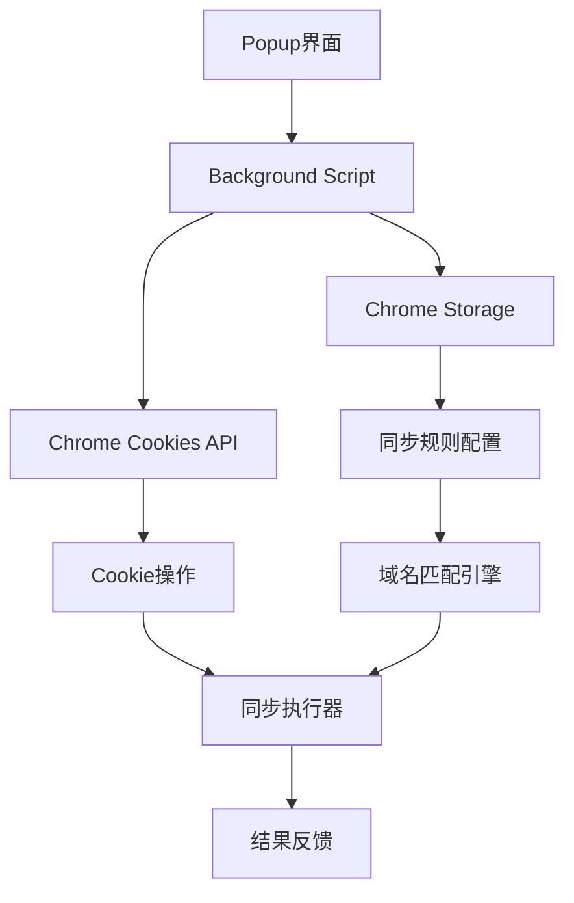

## 背景介绍

在现代 Web 开发中，跨域名 Cookie 同步是一个常见的需求。无论是多子域名环境下的用户状态保持，还是测试环境中的账号切换，都需要一种高效可靠的 Cookie 同步机制。然而，浏览器本身并不提供跨域 Cookie 同步功能，这给开发者和测试人员带来了诸多不便。

传统的解决方案包括手动复制 Cookie、使用浏览器插件或编写脚本，但这些方法要么操作繁琐，要么功能有限。为此，我们开发了一款基于 Chrome 扩展的 Cookie 同步工具，旨在提供简单、安全、高效的跨域名 Cookie 同步体验。

## 方案对比

### 传统方案分析

1. **手动复制粘贴**

   - 优点：简单直接，无需额外工具
   - 缺点：操作繁琐，容易出错，无法实时同步

2. **浏览器开发者工具脚本**

   - 优点：灵活性高，可定制性强
   - 缺点：需要技术背景，安全性存疑，维护成本高

3. **现有浏览器插件**
   - 优点：开箱即用，用户友好
   - 缺点：功能单一，缺乏定制性，可能存在隐私风险

### 我们的解决方案

基于 Manifest V3 标准的 Chrome 扩展，具备以下优势：

- **安全性**：遵循 Chrome 扩展安全规范，权限可控
- **易用性**：直观的图形界面，一键同步操作
- **灵活性**：支持自定义同步规则，多域名配置
- **性能**：智能缓存机制，减少不必要的同步操作

## 技术架构

### 技术栈选择

- **前端框架**：Vue 3 + TypeScript
- **构建工具**：Vite
- **UI 组件库**：TDesign
- **扩展标准**：Manifest V3
- **存储方案**：Chrome Storage API

### 系统架构图



## 实现步骤

### 第一步：项目初始化

使用 Vite 创建 Vue 3 项目，配置 TypeScript 和必要的依赖：

```bash
npm create vite@latest chrome-cookie-sync -- --template vue-ts
cd chrome-cookie-sync
npm install @tdesign/vue-next
```

### 第二步：Manifest 配置

创建`public/manifest.json`文件，配置扩展基本信息、权限和资源：

```json
{
  "manifest_version": 3,
  "name": "Cookie Sync Extension",
  "version": "1.0.0",
  "description": "跨域名Cookie同步工具",
  "permissions": ["cookies", "storage"],
  "host_permissions": ["<all_urls>"],
  "action": {
    "default_popup": "index.html"
  },
  "background": {
    "service_worker": "background.js"
  }
}
```

### 第三步：核心数据类型定义

在`src/type.ts`中定义项目核心数据类型：

```typescript
export interface SyncRule {
  id: string;
  sourceDomain: string;
  targetDomains: string[];
  enabled: boolean;
  syncAllCookies: boolean;
  specificCookies: string[];
}

export interface CookieInfo {
  name: string;
  value: string;
  domain: string;
  path: string;
  secure: boolean;
  httpOnly: boolean;
}
```

### 第四步：存储管理 Hook

实现`src/hooks/useStorage.ts`，提供统一的数据存储接口：

```typescript
export function useStorage() {
  const getRules = async (): Promise<SyncRule[]> => {
    const result = await chrome.storage.sync.get("syncRules");
    return result.syncRules || [];
  };

  const saveRules = async (rules: SyncRule[]): Promise<void> => {
    await chrome.storage.sync.set({ syncRules: rules });
  };

  return { getRules, saveRules };
}
```

### 第五步：主界面组件

实现`src/App.vue`，包含规则配置、同步控制等功能：

```vue
<template>
  <div class="cookie-sync-app">
    <t-card title="Cookie同步规则">
      <!-- 规则配置界面 -->
    </t-card>

    <t-card title="同步控制">
      <!-- 同步操作界面 -->
    </t-card>
  </div>
</template>
```

### 第六步：后台脚本实现

在`public/background.js`中实现 Cookie 同步的核心逻辑：

```javascript
chrome.runtime.onMessage.addListener((request, sender, sendResponse) => {
  if (request.action === "syncCookies") {
    handleCookieSync(request.data);
  }
});

async function handleCookieSync(syncData) {
  // Cookie同步逻辑实现
}
```

## 核心功能实现

### Cookie 同步算法

1. **域名匹配**：基于配置的同步规则，智能匹配源域名和目标域名
2. **Cookie 过滤**：支持全量同步和指定 Cookie 同步两种模式
3. **安全验证**：检查 Cookie 的安全属性，确保同步过程的安全性

### 缓存优化策略

- **增量同步**：只同步发生变化的 Cookie
- **时间戳记录**：记录上次同步时间，避免重复操作
- **错误重试**：实现自动重试机制，提高同步成功率

### 用户界面设计

- **响应式布局**：适配不同尺寸的弹出窗口
- **状态反馈**：实时显示同步进度和结果
- **配置管理**：支持规则的增删改查和导入导出

## 技术难点与解决方案

### 难点一：跨域 Cookie 访问限制

**问题**：Chrome 的安全策略限制跨域 Cookie 访问

**解决方案**：

- 使用`chrome.cookies`API 获取和设置 Cookie
- 配置正确的域名权限和协议匹配
- 实现域名解析和规范化处理

### 难点二：性能优化

**问题**：大量 Cookie 同步时的性能问题

**解决方案**：

- 实现异步批量处理
- 添加进度指示和取消功能
- 优化存储读写操作

### 难点三：数据一致性

**问题**：多标签页同时操作时的数据竞争

**解决方案**：

- 使用 Chrome Storage 的原子操作
- 实现操作队列机制
- 添加冲突检测和解决策略

## 测试与验证

### 单元测试

使用 Vitest 框架编写组件和工具函数的单元测试：

```typescript
describe("Cookie同步功能", () => {
  it("应该正确匹配域名规则", () => {
    // 测试用例实现
  });
});
```

### 集成测试

通过 Chrome 扩展测试框架验证端到端功能：

- 安装和加载测试
- 权限申请验证
- 实际同步操作测试

### 性能测试

- 同步大量 Cookie 时的响应时间
- 内存使用情况监控
- 长时间运行的稳定性

## 部署与发布

### 开发环境配置

1. 配置开发服务器和热重载
2. 设置调试工具和日志系统
3. 准备测试数据和场景

### 生产构建

使用 Vite 进行生产环境构建：

```bash
npm run build
```

### Chrome Web Store 发布

1. 准备扩展截图和描述信息
2. 通过 Chrome 开发者控制台提交审核
3. 配置自动更新和版本管理

## 最佳实践总结

### 安全性考虑

1. **最小权限原则**：只申请必要的 API 权限
2. **数据加密**：敏感信息进行加密存储
3. **输入验证**：对所有用户输入进行严格验证

### 用户体验优化

1. **操作反馈**：提供清晰的操作状态提示
2. **错误处理**：友好的错误信息和恢复建议
3. **性能优化**：减少不必要的等待时间

### 代码质量保证

1. **类型安全**：充分利用 TypeScript 的类型检查
2. **代码规范**：遵循统一的代码风格和命名约定
3. **文档完善**：提供详细的使用说明和 API 文档

## 未来规划

### 功能扩展

1. **同步历史记录**：记录每次同步的详细日志
2. **智能规则推荐**：基于使用习惯推荐同步规则
3. **多浏览器支持**：扩展支持 Firefox、Edge 等浏览器

### 技术优化

1. **性能监控**：集成性能分析和监控工具
2. **自动化测试**：完善测试覆盖率和自动化流程
3. **架构升级**：考虑微前端架构支持插件化扩展

## 参考文献

1. [Chrome Extensions Documentation](https://developer.chrome.com/docs/extensions/)
2. [Manifest V3 Migration Guide](https://developer.chrome.com/docs/extensions/mv3/intro/)
3. [Chrome Cookies API Reference](https://developer.chrome.com/docs/extensions/reference/cookies/)
4. [Vue 3 Composition API](https://vuejs.org/guide/extras/composition-api-faq.html)
5. [TypeScript Handbook](https://www.typescriptlang.org/docs/)

## 结语

通过这个项目的开发实践，我们不仅解决了一个具体的业务问题，更重要的是积累了 Chrome 扩展开发、现代前端技术栈应用和用户体验设计的宝贵经验。希望这篇文章能为有志于浏览器扩展开发的同行提供参考和启发。

项目源码已开源在 GitHub，欢迎 Star 和贡献：
[项目仓库地址](https://github.com/yxuanzhang/chrome-extension-sync-cookies)
