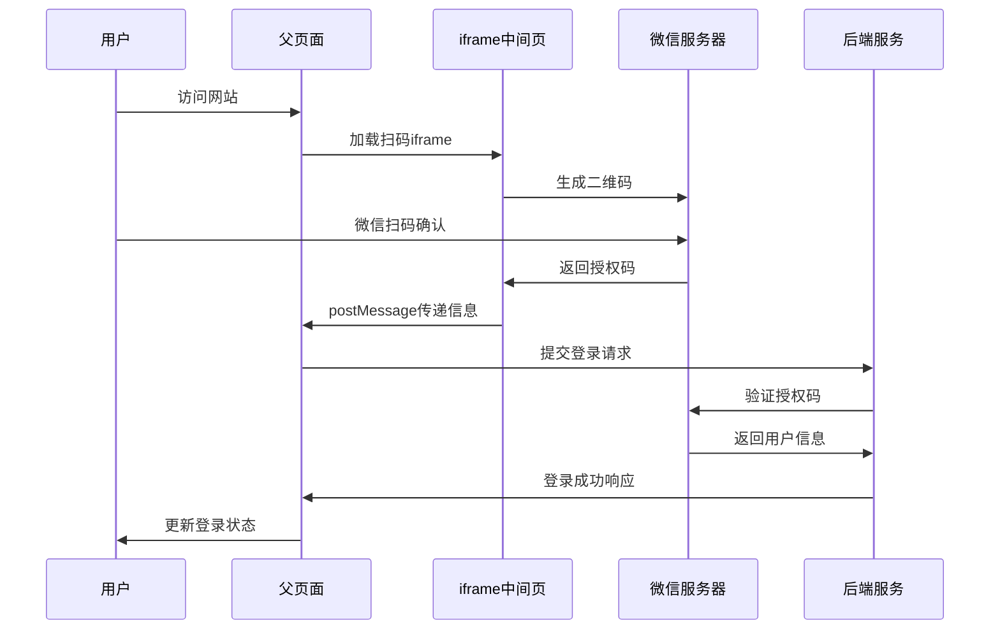
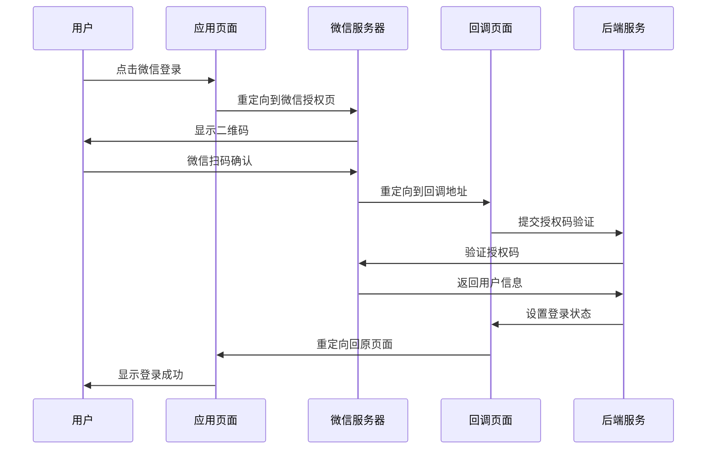

## 一、引言

在 PC 端网站应用中，微信扫码登录因其便捷性而被广泛采用。对于前端开发者而言，接入微信扫码登录主要有两种交互方式：一种是页面内嵌二维码（iframe），另一种是跳转到微信域名的全屏二维码页面。

本文将基于 **Vue 3** 技术栈，详细介绍这两种方案的前端实现细节。

## 二、准备工作

在开始编码之前，请确保已完成以下准备工作：

1.  **注册账号**：拥有[微信开放平台](https://open.weixin.qq.com/)账号，并完成开发者资质认证。
2.  **创建应用**：在管理中心创建"网站应用"，并获得 `AppID` 和 `AppSecret`。
3.  **配置域名**：在应用详情中配置"授权回调域"，确保回调地址的域名与配置一致（注意：不需要协议头，如 `www.example.com`，开发阶段可填`localhost:port`）。

## 三、方案一：内嵌 iframe (self_redirect=true)

此方案通过在页面中嵌入一个 iframe 来展示二维码，用户扫码确认后，微信会在 iframe 内跳转到回调地址。为了实现无刷新登录，我们需要利用 `postMessage` 进行跨域通信。

### 1. 核心流程



1.  前端页面加载微信 JS 文件或直接构建 iframe URL。
2.  设置 `self_redirect=true`，使得扫码后在 iframe 内跳转。
3.  iframe 内跳转到的中间页（回调页）获取 code，并通过 `window.parent.postMessage` 将 code 传递给父页面。
4.  父页面监听 `message` 事件，获取 code 并调用后端登录接口。

### 2. Vue 3 组件封装 (`WxLogin.vue`)

我们可以封装一个 Vue 组件 或 直接为 login 页面来处理 iframe 的加载和消息监听。

```ts

/**
 * 注入script脚本
 */
function injecWxQrCodeScript() {
  if (window.WxLogin) {
    return;
  }

  const s = document.createElement('script');
  s.type = 'text/javascript';
  s.src = 'https://res.wx.qq.com/connect/zh_CN/htmledition/js/wxLogin.js';
  const wxElement = document.body.appendChild(s);

  wxElement.onload = async function () {
    initWxQrCode();
  };
}
/**
 * 实例微信js对象
 */
async function initWxQrCode() {
  try {
    data.qrCodeLoading = true;

    const result = await apiGetLoginParam();
    setJSESSIONID(result?.SessionId); // 设置JSESSIONID，60秒过期
    const wxLoginQrcode = new WxLogin({
      // true：手机点击确认登录后可以在 iframe 内跳转到 redirect_uri，false：手机点击确认登录后可以在 top window 跳转到 redirect_uri。默认为 false。
      self_redirect: true,
      // 快速登录
      fast_login: 0,
      // 新版
      // stylelite: 1,
      // 需要显示的容器id
      id: 'qr-code',
      // 微信开放平台appid wx*******
      appid: result?.Appid,
      scope: 'snsapi_login', // 网页默认即可
      // 授权成功后回调的url
      redirect_uri: encodeURIComponent(import.meta.env.VITE_LOGIN_REDIRECT_URI),
      state: result?.State || Math.ceil(Math.random() * 1000), // 可设置为简单的随机数加session用来校验
      style: 'black', // 提供"black"、"white"可选。二维码的样式
      // 外部css文件url，需要https，这里直接将自定义css转换为base64
      href: 'data:text/css;base64,LmltcG93ZXJCb3ggLnFyY29kZSB7bWFyZ2luLXRvcDowO30KLmltcG93ZXJCb3ggLnRpdGxlIHtkaXNwbGF5OiBub25lO30=',
    });
    console.log('wxLoginQrcode', wxLoginQrcode);
  } catch (e) {
    console.error(e);
  } finally {
    data.qrCodeLoading = false;
  }
}

// 监听 postMessage 消息
const handleMessage = (event) => {
  // 安全检查：建议校验 event.origin
  // if (event.origin !== 'YOUR_DOMAIN_ORIGIN') return;

  const { code, state } = event.data || {};

  if (code) {
    // 调用应用后端，校验扫码登录结果，并获取tokne、refreshToken等
    loginCallback(code as string, state as string);
  }
};

onMounted(() => {
  try {
    window.addEventListener("message", handleMessage);
  } catch (error) {
    console.error("微信SDK加载失败", error);
    emit("error", error);
  }
});

onUnmounted(() => {
  window.removeEventListener("message", handleMessage);
});
</script>

<style scoped>
.wx-login-container {
  display: flex;
  justify-content: center;
  align-items: center;
  min-height: 400px;
}
</style>
```

### 3. 中间页处理 (`callback.vue`)

这是 `redirect_uri` 指向的页面。当用户扫码成功后，iframe 会跳转到这个页面。这个页面需要做的唯一事情就是把 URL 中的 `code` 发送给父页面。

**注意**：此页面必须部署在配置的授权回调域下。

```ts
// 解析 URL 参数
function getQueryParam(name) {
  const reg = new RegExp("(^|&)" + name + "=([^&]*)(&|$)");
  const r = window.location.search.substr(1).match(reg);
  return r != null ? unescape(r[2]) : null;
}

onMounted(() => {
  const code = getQueryParam("code");
  const state = getQueryParam("state");

  if (code && state) {
    // 将 code 发送给父页面
    // targetOrigin 建议设置为父页面的源，生产环境请勿使用 '*'
    window.parent.postMessage({ code, state }, "*");
  } else {
    // 可以在这里处理错误或关闭窗口
    console.error("未获取到 code");
  }
});
```

## 四、方案二：重定向 (self_redirect=false)

此方案会将当前页面完整跳转到微信的二维码页面，用户扫码后，微信再将页面重定向回我们的回调地址。

### 1. 核心流程



1.  用户点击"微信登录"按钮。
2.  前端拼接微信授权 URL，使用 `window.location.href` 跳转。
3.  用户在微信页面扫码确认。
4.  页面跳转回 `redirect_uri`，URL 中携带 `code` 参数。
5.  前端在回调页面的生命周期中获取 `code`，调用后端接口完成登录。

### 2. 初始化二维码

```javascript
/**
 * 注入script脚本
 */
function injecWxQrCodeScript() {
  const s = document.createElement("script");
  s.type = "text/javascript";
  s.src = "https://res.wx.qq.com/connect/zh_CN/htmledition/js/wxLogin.js";
  const wxElement = document.body.appendChild(s);

  wxElement.onload = async function () {
    initWxQrCode();
  };
}
/**
 * 实例微信js对象
 */
async function initWxQrCode() {
  try {
    data.qrCodeLoading = true;

    const result = await apiGetLoginParam();
    setJSESSIONID(result?.SessionId); // 设置JSESSIONID，60秒过期
    const wxLoginQrcode = new WxLogin({
      // true：手机点击确认登录后可以在 iframe 内跳转到 redirect_uri，false：手机点击确认登录后可以在 top window 跳转到 redirect_uri。默认为 false。
      self_redirect: false,
      // 快速登录
      fast_login: 0,
      // 新版
      // stylelite: 1,
      // 需要显示的容器id
      id: "qr-code",
      // 微信开放平台appid wx*******
      appid: result?.Appid,
      scope: "snsapi_login", // 网页默认即可
      // 授权成功后回调的url
      redirect_uri: encodeURIComponent(import.meta.env.VITE_LOGIN_REDIRECT_URI),
      state: result?.State || Math.ceil(Math.random() * 1000), // 可设置为简单的随机数加session用来校验
      style: "black", // 提供"black"、"white"可选。二维码的样式
      // 外部css文件url，需要https，这里直接将自定义css转换为base64
      href: "data:text/css;base64,LmltcG93ZXJCb3ggLnFyY29kZSB7bWFyZ2luLXRvcDowO30KLmltcG93ZXJCb3ggLnRpdGxlIHtkaXNwbGF5OiBub25lO30=",
    });
    console.log("wxLoginQrcode", wxLoginQrcode);
  } catch (e) {
    console.error(e);
  } finally {
    data.qrCodeLoading = false;
  }
}

onMounted(() => {
  injecWxQrCodeScript();
});
```

### 3. 回调处理 (Vue 3)

假设我们将 `redirect_uri` 设置为登录页本身 (`/login`)，我们需要在登录页的 `onMounted` 中检查 URL 是否包含 `code`。

```ts
onMounted(() => {
  injecWxQrCodeScript();

  // 优先处理Token验证参数
  const hasWechatParams = route.query.code && route.query.state;

  if (hasWechatParams) {
    // 如果没有Token参数，但有微信登录参数，则处理微信登录
    const code = Array.isArray(route.query.code)
      ? route.query.code[0]
      : route.query.code;
    const state = Array.isArray(route.query.state)
      ? route.query.state[0]
      : route.query.state;
    // 调用应用后端，校验扫码登录结果，并获取tokne、refreshToken等
    loginCallback(code as string, state as string);
  }
});
```

## 五、最佳实践建议

1.  **安全性**：无论哪种方案，`AppSecret` 都不应暴露在前端代码中。前端只负责获取 `code`，通过后端接口换取 `access_token`。
2.  **State 参数**：建议使用随机字符串作为 `state` 参数，并在回调时校验，以防止 CSRF 攻击。
3.  **样式定制**：可以通过 `href` 参数加载自定义 CSS 来修改二维码页面的样式（需要是 HTTPS 链接）。

| 特性           | iframe 方案 (self_redirect=true)        | 重定向方案 (self_redirect=false) |
| -------------- | --------------------------------------- | -------------------------------- |
| **用户体验**   | ⭐⭐⭐⭐⭐ (无刷新)                     | ⭐⭐⭐ (页面跳转)                |
| **兼容性**     | ⭐⭐⭐ (部分浏览器限制)                 | ⭐⭐⭐⭐⭐ (广泛兼容)            |
| **安全性**     | ⭐⭐⭐⭐ (需要严格验证)                 | ⭐⭐⭐⭐⭐ (标准流程)            |
| **实现复杂度** | ⭐⭐⭐⭐ (需要处理 iframe 通信和中间页) | ⭐⭐⭐ (标准实现)                |

## 六、 选择建议

### 6.1 推荐使用 iframe 方案的情况

- **单页应用(SPA)**：需要保持页面状态不变
- **用户体验优先**：追求无刷新登录体验
- **技术团队较强**：有能力处理复杂的前后端交互
- **现代浏览器环境**：用户主要使用 Chrome、Firefox 等现代浏览器

### 6.2 推荐使用重定向方案的情况

- **传统多页应用**：页面跳转不影响用户体验
- **兼容性要求高**：需要支持各种老旧浏览器
- **安全要求严格**：遵循标准的 OAuth2.0 流程
- **快速上线**：希望快速实现基本功能

### 6.3 混合方案建议

对于大多数项目，推荐采用混合方案：

```javascript
// 智能方案选择
class SmartWeChatLogin {
  constructor() {
    this.supported = this.checkIframeSupport();
  }

  // 检查iframe支持情况
  checkIframeSupport() {
    // 检查浏览器是否支持postMessage和现代特性
    return typeof window.postMessage === "function" && !this.isLegacyBrowser();
  }

  // 判断是否为老旧浏览器
  isLegacyBrowser() {
    const ua = navigator.userAgent;
    return ua.includes("MSIE ") || ua.includes("Trident/");
  }

  // 智能选择登录方案
  login() {
    if (this.supported) {
      this.iframeLogin();
    } else {
      this.redirectLogin();
    }
  }

  // iframe方案
  iframeLogin() {}

  // 重定向方案
  redirectLogin() {}
}
```

## 七、结语

微信扫码登录是现代网站应用身份认证的重要技术，它代表了用户体验和安全性的完美结合。通过合理选择技术方案并严格实施安全措施，开发者可以为用户提供既便捷又安全的登录体验。
