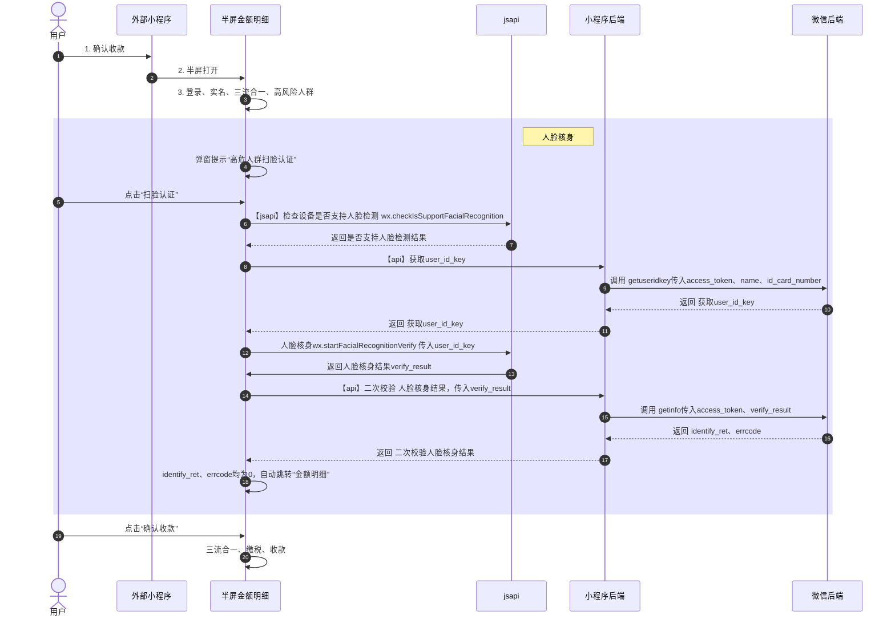

# 交互流程



```js
import { apiGetUserIdKey, apiVerifyFace } from "@services/nature";

const startFacialRecognitionVerify = (userIdKey) =>
  new Promise((resolve) => {
    wx.startFacialRecognitionVerify({
      userIdKey,
      success: (result) => {
        resolve(result);
      },
      fail: (e) => {
        console.log("fail", e);
        resolve(e);
      },
      // complete: () => {
      //   console.log('complete');
      // },
    });
  });
/**
 * 判断当前用户设备 是否支持
 */
const checkIsSupportFacialRecognition = () =>
  new Promise((resolve) => {
    wx.checkIsSupportFacialRecognition({
      // 支持
      success: () => {
        resolve(true);
      },
      // 不支持
      fail: () => {
        resolve(false);
      },
      // complete: () => {
      //   resolve(false);
      // },
    });
  });
/**
 * 人脸核身校验
 */
const facialRecognitionVerify = async () => {
  // 1. 判断当前用户设备 是否支持
  const success = await checkIsSupportFacialRecognition();
  if (!success) {
    return {
      success: false,
      errMsg: "当前微信版本过低，请升级微信至最新版本后重试。",
    };
  }
  // 2. 获取用户 user_id_key
  const resultUserIdKey = await apiGetUserIdKey({ source: 1 });
  if (!resultUserIdKey.userIdKey || resultUserIdKey.errcode !== 0) {
    return {
      success: false,
      errMsg: resultUserIdKey.errmsg || "获取扫脸用户凭证失败",
    };
  }
  // 3. 调用jsapi 唤起人脸核审
  const verifyResult = await startFacialRecognitionVerify(
    resultUserIdKey.userIdKey
  );
  if (verifyResult.errCode !== 0) {
    const errMsg = verifyResult.errMsg?.includes("cancel")
      ? "用户取消人脸识别，无法正常收款"
      : verifyResult.errMsg;
    return { success: false, errMsg: errMsg || "人脸识别失败，请稍后重试" };
  }
  // 4. 二次校验，jsapi认证结果
  const verifyFaceResult = await apiVerifyFace({
    verifyResult: verifyResult.verifyResult,
    source: 1,
  });
  if (verifyFaceResult.identifyRet !== 0 || verifyFaceResult.errcode !== 0) {
    return {
      success: false,
      errMsg: verifyFaceResult.errmsg || "人脸识别失败，请稍后重试",
    };
  }
  console.log("facialRecognitionVerify4", verifyFaceResult);
  return { success: true };
};

/**
 * 弹窗提示高风险人群 需人脸识别
 */
const showFacialRecognitionVerifyModal = (content) =>
  new Promise((resolve) => {
    wx.showModal({
      title: "温馨提示",
      content,
      cancelText: "暂不认证",
      confirmText: "扫脸认证",
      confirmColor: "#008858",
      success: (res) => {
        if (res.confirm) {
          resolve(true);
        } else if (res.cancel) {
          // 阻断流程
          resolve(false);
        }
      },
    });
  });
module.exports = {
  facialRecognitionVerify,
  showFacialRecognitionVerifyModal,
};
```
