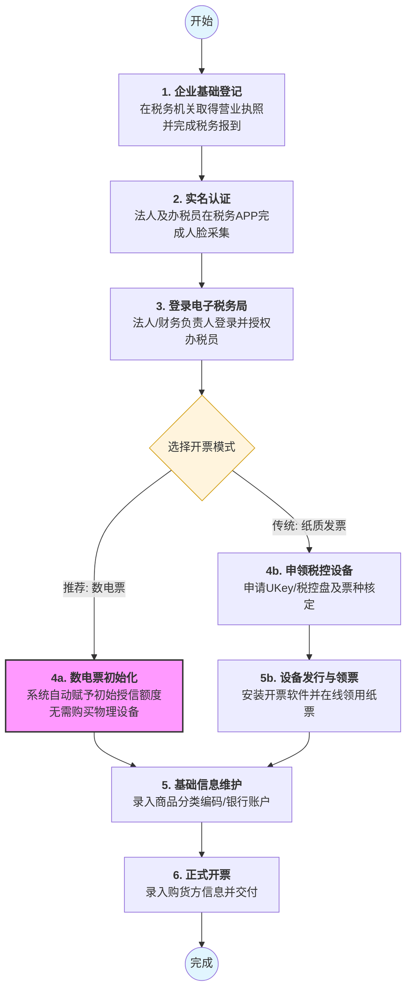
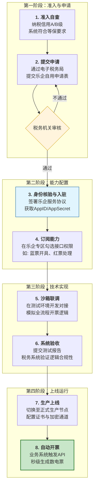

# 背景

## 1. 企业如何开通税局开票能力

```mermaid
graph TD
    Start((开始)) --> Registration[<b>1. 企业基础登记</b><br/>在税务机关取得营业执照<br/>并完成税务报到]
    Registration --> RealName[<b>2. 实名认证</b><br/>法人及办税员在税务APP完成人脸采集]
    RealName --> Login[<b>3. 登录电子税务局</b><br/>法人/财务负责人登录并授权办税员]

    Login --> Choice{选择开票模式}

    %% 数电票路径
    Choice -- 推荐: 数电票 --> Digital[<b>4a. 数电票初始化</b><br/>系统自动赋予初始授信额度<br/>无需购买物理设备]
    Digital --> SetInfo[<b>5. 基础信息维护</b><br/>录入商品分类编码/银行账户]

    %% 纸质发票路径
    Choice -- 传统: 纸质发票 --> Physical[<b>4b. 申领税控设备</b><br/>申请UKey/税控盘及票种核定]
    Physical --> Receive[<b>5b. 设备发行与领票</b><br/>安装开票软件并在线领用纸票]
    Receive --> SetInfo

    SetInfo --> Issue[<b>6. 正式开票</b><br/>录入购货方信息并交付]
    Issue --> End((完成))

    style Digital fill:#f9f,stroke:#333,stroke-width:2px
    style Choice fill:#fff4dd,stroke:#d4a017
    style Start fill:#e1f5fe
    style End fill:#e1f5fe
```

## 2. 直连模式下的 自用、联用、他用

```mermaid
graph TD
    subgraph Phase1 [第一阶段：准入与申请]
        A[<b>1. 准入自查</b><br/>纳税信用A/B级<br/>系统符合等保要求] --> B[<b>2. 提交申请</b><br/>通过电子税务局<br/>提交乐企自用申请表]
        B --> C{税务机关审核}
        C -- 不通过 --> B
    end

    subgraph Phase2 [第二阶段：能力配置]
        C -- 通过 --> D[<b>3. 身份核验与入驻</b><br/>签署乐企服务协议<br/>获取AppID/AppSecret]
        D --> E[<b>4. 订阅能力</b><br/>在乐企专区勾选接口权限<br/>如: 蓝票开具、红票处理]
    end

    subgraph Phase3 [第三阶段：技术实现]
        E --> F[<b>5. 沙箱联调</b><br/>在测试环境开发对接<br/>模拟全流程开票逻辑]
        F --> G[<b>6. 系统验收</b><br/>提交测试报告<br/>税务系统验证逻辑合规性]
    end

    subgraph Phase4 [第四阶段：上线运行]
        G --> H[<b>7. 生产上线</b><br/>切换至正式生产节点<br/>配置证书与加密通道]
        H --> I[<b>8. 自动开票</b><br/>业务系统触发API<br/>秒级生成数电票]
    end

    %% 样式美化
    style C fill:#fff4dd,stroke:#d4a017
    style D fill:#e1f5fe,stroke:#01579b
    style I fill:#c8e6c9,stroke:#2e7d32,stroke-width:2px
```
