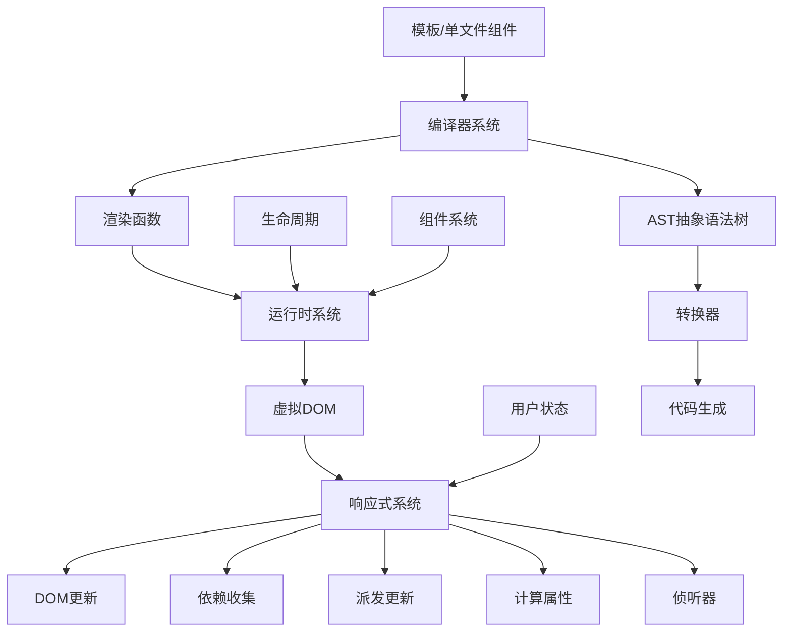

# Vue.js 3.5 技术架构深度解读

## 项目概述

Vue.js 是一个渐进式 JavaScript 框架，采用现代化的模块化架构设计。本项目是 Vue.js 的核心代码库，采用 monorepo 结构组织，包含完整的响应式系统、编译器、运行时等核心模块。

## 整体架构设计

### 模块化架构

Vue.js 采用高度模块化的架构设计，主要分为以下几个核心包：

```
packages/
├── reactivity/      # 响应式系统核心
├── runtime-core/    # 运行时核心
├── runtime-dom/     # DOM运行时适配
├── compiler-core/   # 编译器核心
├── compiler-dom/    # DOM编译器
├── compiler-sfc/    # 单文件组件编译器
├── compiler-ssr/    # SSR编译器
├── shared/          # 共享工具函数
└── vue/             # 主包（整合所有模块）
```

### 技术架构图



## 核心模块技术原理

### 1. 响应式系统 (Reactivity System)

#### 核心设计思想

Vue.js 的响应式系统基于 Proxy 和依赖收集机制，实现了细粒度的数据变更追踪。

#### 关键实现原理

**Ref 实现机制**：

```typescript
class RefImpl<T> {
  private _value: T;
  private _rawValue: T;
  dep: Dep = new Dep(); // 依赖收集器

  get value() {
    this.dep.track(); // 依赖收集
    return this._value;
  }

  set value(newValue) {
    if (hasChanged(newValue, this._rawValue)) {
      this._rawValue = newValue;
      this._value = toReactive(newValue);
      this.dep.trigger(); // 派发更新
    }
  }
}
```

**依赖收集流程**：

1. 当 effect 函数执行时，会设置当前活跃的 effect
2. 访问响应式数据时，触发 getter，收集当前 effect 到 dep 中
3. 数据变更时，触发 setter，通知所有依赖的 effect 重新执行

#### 核心特性

- **细粒度更新**：只更新真正依赖变更数据的组件
- **惰性计算**：computed 值只在被访问时计算
- **批量更新**：通过调度器实现异步批量更新
- **内存管理**：通过 effectScope 管理副作用生命周期

### 2. 编译器系统 (Compiler System)

#### 编译流程三阶段

**1. 解析阶段 (Parse)**

- 将模板字符串转换为 AST（抽象语法树）
- 识别 HTML 标签、属性、指令、插值表达式

**2. 转换阶段 (Transform)**

- 对 AST 进行语义分析和优化
- 应用各种转换器：v-if、v-for、v-model、v-on 等
- 静态提升、树结构优化

**3. 代码生成阶段 (Codegen)**

- 将优化后的 AST 转换为渲染函数
- 生成虚拟 DOM 创建代码
- 优化运行时性能

#### 核心编译函数

```typescript
export function baseCompile(source: string, options: CompilerOptions) {
  // 1. 解析模板为AST
  const ast = isString(source) ? baseParse(source, options) : source;

  // 2. 转换AST
  transform(ast, {
    nodeTransforms: [
      transformIf, // v-if 转换
      transformFor, // v-for 转换
      transformElement, // 元素转换
      transformText, // 文本转换
    ],
    directiveTransforms: {
      on: transformOn, // v-on 转换
      bind: transformBind, // v-bind 转换
      model: transformModel, // v-model 转换
    },
  });

  // 3. 生成渲染函数
  return generate(ast, options);
}
```

### 3. 虚拟 DOM 系统 (Virtual DOM)

#### VNode 数据结构

```typescript
interface VNode {
  type: VNodeTypes; // 节点类型（元素、组件、文本等）
  props: VNodeProps | null; // 属性对象
  children: VNodeChildren; // 子节点
  key: string | null; // 唯一标识
  el: HTMLElement | null; // 对应的真实DOM
  shapeFlag: number; // 形状标志（优化用）
  patchFlag: number; // 补丁标志（优化用）
}
```

#### 块树优化 (Block Tree)

Vue.js 3 引入了块树概念，大幅提升渲染性能：

```typescript
// 块树跟踪动态节点
function openBlock(disableTracking = false) {
  blockStack.push((currentBlock = disableTracking ? null : []));
}

function createBlock(type, props, children, patchFlag) {
  const vnode = createVNode(type, props, children, patchFlag);
  vnode.dynamicChildren = currentBlock; // 只跟踪动态子节点
  return vnode;
}
```

#### Diff 算法优化

- **静态提升**：静态节点在编译时提升，避免重复创建
- **靶向更新**：通过 patchFlag 只更新变化的属性
- **快速路径**：相同类型的节点直接复用

### 4. 运行时系统 (Runtime System)

#### 组件实例管理

```typescript
interface ComponentInternalInstance {
  uid: number; // 唯一标识
  type: Component; // 组件定义
  vnode: VNode; // 组件虚拟节点
  subTree: VNode; // 渲染子树
  props: Data; // 组件属性
  attrs: Data; // 透传属性
  slots: Slots; // 插槽内容
  emit: EmitFn; // 事件发射器
  exposed: Record<string, any>; // 暴露的API
  setupState: Data; // setup函数返回的状态
}
```

#### 渲染管线 (Rendering Pipeline)

1. **组件挂载**：创建组件实例，执行 setup，生成渲染函数
2. **渲染执行**：执行渲染函数生成 VNode 子树
3. **补丁过程**：比较新旧 VNode，更新真实 DOM
4. **生命周期**：触发相应的生命周期钩子

#### 组合式 API 实现

```typescript
// setup 函数执行上下文
export function setupComponent(instance: ComponentInternalInstance) {
  const { props, children } = instance.vnode;

  // 解析组件选项
  const options = instance.type;
  const { setup, render, template } = options;

  // 执行 setup 函数
  if (setup) {
    const setupResult = callWithErrorHandling(setup, instance, [
      instance.props,
      setupContext,
    ]);

    // 处理 setup 返回值
    if (isFunction(setupResult)) {
      instance.render = setupResult;
    } else if (isObject(setupResult)) {
      instance.setupState = setupResult;
    }
  }
}
```

## 高级特性实现

### 1. Teleport 组件

实现将组件内容渲染到 DOM 树的任意位置：

```typescript
const TeleportImpl = {
  __isTeleport: true,
  process(n1, n2, container, anchor) {
    if (n1 == null) {
      // 挂载：将内容插入目标容器
      mountChildren(n2.children, n2.props.to);
    } else {
      // 更新：移动内容到新位置
      moveTeleportChildren(n1, n2, container, anchor);
    }
  },
};
```

### 2. Suspense 组件

处理异步组件加载状态：

```typescript
const SuspenseImpl = {
  async setup(props, { slots }) {
    const content = slots.default();
    const fallback = slots.fallback();

    // 监控异步组件加载状态
    const promises = getSuspenseChildrenPromises(content);

    if (promises.length > 0) {
      // 显示加载状态
      return () => fallback;
    } else {
      // 显示实际内容
      return () => content;
    }
  },
};
```

### 3. KeepAlive 组件

组件缓存和状态保持：

```typescript
const KeepAliveImpl = {
  __isKeepAlive: true,

  setup(props, { slots }) {
    const cache = new Map();
    const keys = new Set();

    return () => {
      const children = slots.default();

      // 查找可复用的组件实例
      const cachedInstance = cache.get(children.key);
      if (cachedInstance) {
        // 激活缓存的组件
        cachedInstance.activate();
        return cachedInstance.subTree;
      } else {
        // 创建新实例并缓存
        const instance = createComponentInstance(children);
        cache.set(children.key, instance);
        keys.add(children.key);

        // LRU 缓存管理
        if (keys.size > props.max) {
          pruneCacheEntry(cache, keys.values().next().value);
        }

        return instance.subTree;
      }
    };
  },
};
```

## 性能优化策略

### 1. 编译时优化

- **静态节点提升**：将静态节点提取到渲染函数外部
- **预字符串化**：将静态内容合并为字符串常量
- **缓存内联事件**：避免重复创建事件处理函数

### 2. 运行时优化

- **块树跟踪**：只跟踪动态子节点，减少 Diff 范围
- **靶向更新**：通过 patchFlag 精确更新变化的属性
- **惰性计算**：computed 值只在被访问时重新计算

### 3. 内存优化

- **Effect 作用域**：自动清理副作用，避免内存泄漏
- **组件缓存**：KeepAlive 组件复用实例，减少创建开销
- **树摇优化**：模块化架构支持按需引入

## 架构设计思想

### 1. 渐进式设计

Vue.js 采用渐进式设计理念，开发者可以根据需求选择使用不同层级的特性：

- **声明式渲染**：基础模板语法
- **组件系统**：可复用组件开发
- **客户端路由**：单页面应用路由
- **状态管理**：大规模状态管理
- **构建工具**：现代化开发体验

### 2. 响应式编程模型

基于响应式数据流的编程模型：

```
数据变更 → 依赖收集 → 派发更新 → 视图更新
```

### 3. 编译时 + 运行时结合

充分利用编译时信息优化运行时性能：

- 编译时分析模板结构
- 生成优化的渲染函数
- 运行时基于编译提示进行优化

### 4. 类型安全优先

全面采用 TypeScript，提供完整的类型定义和智能提示。

## 总结

Vue.js 3.5 的架构设计体现了现代前端框架的先进理念：

1. **模块化架构**：清晰的职责分离，便于维护和扩展
2. **性能优先**：编译时优化 + 运行时优化的双重策略
3. **开发体验**：组合式 API 提供更好的逻辑复用和类型安全
4. **渐进式采用**：支持从简单到复杂的各种使用场景

这种架构设计使得 Vue.js 既能满足简单页面的快速开发需求，也能支撑大型复杂应用的长期维护。
